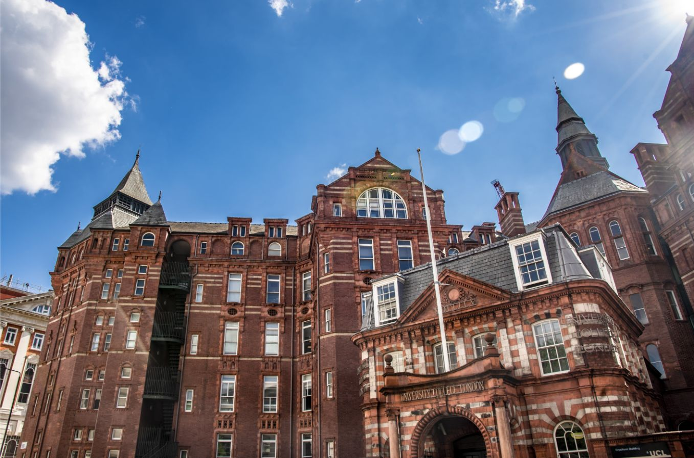
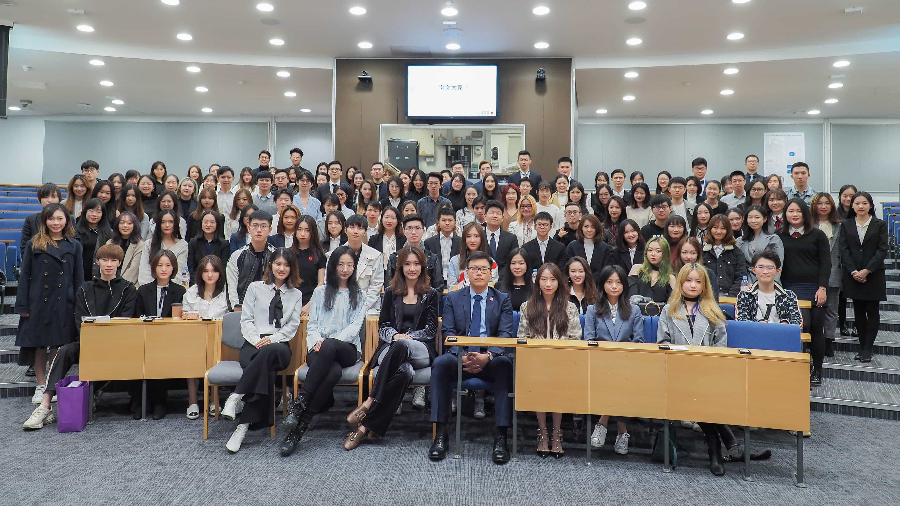
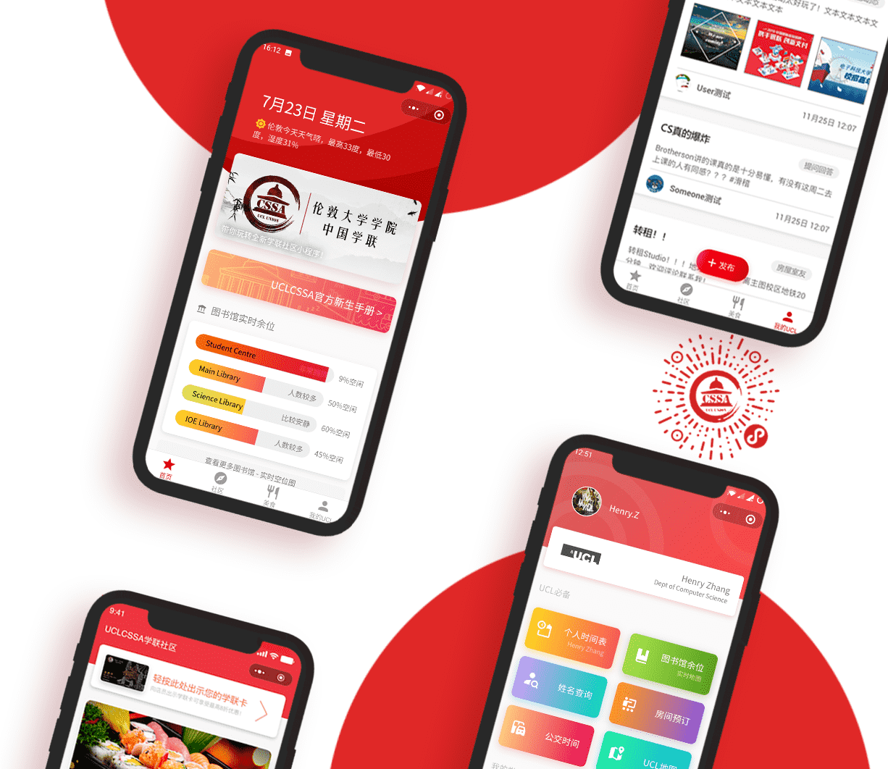

# 欢迎来到UCL

## UCL简介


电脑版可访问 [book.uclcssa.cn](https://book.uclcssa.cn) 查看此手册


伦敦大学学院（University College London），简称UCL，建校于1826年，位于英国伦敦，是一所世界著名的顶尖高等学府，为享有顶级学术声誉的综合研究型大学。它是伦敦大学联盟University of London（简称UOL）的创校学院，与剑桥大学、牛津大学、帝国理工大学、伦敦政治经济学院并称“G5超级精英大学“。“G5超级精英大学”代表了英国最顶尖的科研实力、师生质量以及经济实力。

伦敦大学学院不仅拥有全球领先的医学院、经济学院、建筑学院、工程科学学院，其理论物理与数学、空间科学、统计学、生命科学、计算神经科学、计算机科学、机器学习与人工智能、电子电气工程、化学与化学工程、土木工程、法学、地理学、教育学、社会与人文科学等领域的卓越成就也名扬世界。学院创始之初拥有医学院、数学与物理学院、工程科学学院和社会科学学院，后逐渐扩至11个大学院。


**校训**

Cuncti adsint meritaeque expectent praemia palmae. 

\(Let all come who by merit deserve the most reward.\) 

——Jeremy Bentham


## 序

### 愿你道路漫长

亦舒写伦敦，说它“一切恰到好处，叫人舒服”。伦敦是一座令人着迷的城市，它古老而俊美，精英荟萃，人才云集。欢迎你来到这座城市，走进伦敦大学学院，一个容纳了41540人的大家庭。你将邂逅来自世界各地的同学，开启一段段妙不可言的缘分。若干年后，当你回想起这段鲜活的时光，以及在图书馆奋战的日日夜夜，必定是充满感激的吧。在你即将遇到的人们中，有这样一群有趣的人，他们组成了UCL-CSSA：一个温馨有爱的集体。他们旨在给广大中国学子提供学习与生活的便利，给予你心灵的憩息，家的方向。在这里，你将会和这些有理想的年轻人结伴同行，携手度过人生中最美丽的几年。以梦为马，不负韶华。这是新生手册的扉页，也是你们人生的开端。愿你喜欢这座优雅的城市，珍惜在UCL度过的每一个平凡却闪光的日子，愿你道路漫长，前程似锦，在生命路的两旁，随时撒种，随时开花…

## 伦大学联简介

伦敦大学学院中国学生学者联谊会UCLU-CSSA（简称“伦大学联“）是一个在UCL Union注册并接受中国驻英大使馆指导的非盈利性学生组织。作为UCL最大的华人社团，长期以来伦大学联得到了UCL校方、中国大使馆以及英国各界华人朋友们的广泛支持。成立至今，伦大学联一直本着以服务UCL的华人学生、学者为对象的宗旨，全面致力于中英文化的交流，提高海外华人学生团体的凝聚力。

学联日常活动主要包括学术讲座、就业指导以及文体活动等。除此之外，学联每年8-9月还会代表UCL校方在北京、上海、深圳、成都等地为UCL的新生举办大型的临行准备会。该活动以UCL学联为平台，更加紧密的将学生、学联、学校三方团结起来，互帮互助，增进了解。简单来说：伦大学联就是一个给小伙伴们办活动、送福利、提供信息、交流感情的大家庭！学联下属的不同部门，也会尽全力去满足大家在不同方面的学习、成长和生活需求。


联系我们

`学联官网` [www.uclcssa.org](https://www.uclcssa.org)

`微博` “伦敦大学学院-中国学联” [http://www.weibo.com/cssaucl](http://www.weibo.com/cssaucl) 

`微信公众号` UCLCSSA


## 学联社区小程序

今年，我们上线了全新的UCLCSSA社区小程序，为所有UCL学生提供了问答交流社区，以及UCL生活学习帮手。若是对于到来UCL，新生手册有疑惑或有各种其他问题，欢迎前往UCLCSSA官方社区小程序提问，我们将积极为你解答！你还可以找到UCL个人时间表，图书馆实时空位地图，房间教室预订，伦敦交通状态，通过姓名查找学生老师信息，以及期待已久的学联卡打折餐厅Finder等服务！

使用微信扫一扫小程序码，或直接长按以下图片即可立刻前往。在小程序里也可以找到本手册哦！


在小程序内点击右上角三点“添加到我的小程序”，即可下次快速找到学联社区。


## 使用该手册

新生手册主要分为四大板块，可以通过左侧或左上角菜单按钮导航主要板块，每页下方也可直接切换上一个或下一个板块。板块目录可在手机版菜单中点击目录按钮或在电脑版右侧目录查看。右上角可搜索任何关键词，跳转到相应位置。

我们还在持续更新手册的内容。若您发现错误，或有内容想要投稿补充，欢迎email至 info@uclcssa.org 或通过其他方式联系我们。


本手册开源并 host 于 github，欢迎直接前往 [https://github.com/UCLCSSA/UCL-Freshers-Guide](https://github.com/UCLCSSA/UCL-Freshers-Guide) 进行编辑并发送Pull Request，你的贡献将以最快的方式发布。


## 分享该手册

阅读该手册的同时，欢迎分享给其他即将来到UCL的同学和校友，帮助更多人！

伦大学联是一个非盈利性组织，该手册及小程序 & 网页版手册均由UCLCSSA成员自发制作，分享给有需要的人的同时也能帮助我们继续维护和更新。


若您是在微信或小程序内阅读本手册，点击右上角三点，点击转发即可分享给其他人。

若您在使用浏览器，您可以复制并发送链接 `https://book.uclcssa.cn/` 给其他人。


