# CSSA学联介绍

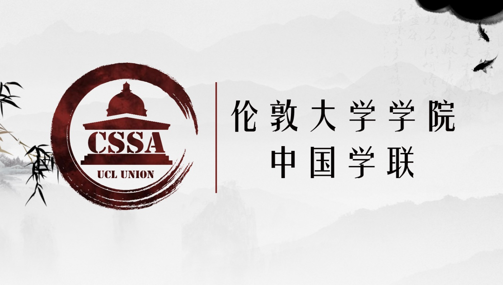

## 2020届组织结构

| 职位 | 姓名 |
| :--- | :--- |
| 主席 | 罗亦阳 Yiyang Luo |
| 副主席 | - |
| 财务长 | 吴可非 Kefei Wu |
| 秘书长 | - |
| 外联部部长 | 黄思超 Sichao Huang |
| 事业部部长 | 谈沂鑫 Yixin Tan |
| 宣信部部长 | 吴疆 Jiang Wu |
| 文化部部长 | 张轩畅 Xuanchang Zhang |
| 文娱部部长 | 秦明暄 Kim Qin |
| 体育部部长 | 杜俊萱 Chun Huen To |
| 中文教育负责人 | 张馨怡 Xinyi Zhang |
| OFUND慈善部部长 | 朱琳 Lin Zhu |
| 艺术团团长 | 西梦 Simone Kayser |
| 春晚总监制 | 卫一君 Yijun Wei |
| 春晚总导演 | 邱海纳 Haina Qiu |
| 辩论队队长 | 张芮铭 Ruiming Zhang |

## 部门介绍

### 外联部

外联部负责学联对外的联系业务，主要通过与中英各大企业及其他相关机构进行商业合作。作为全学联整理运营，为学联举办的活动提供资金支持。外联部同时也帮助在英留学生与外界企业建立联系，商谈的商家中不乏世界500强企业，其帮助开拓及加深了学联与各大企业及其他社会团体的联系，是学联运营和发展的基石部门。

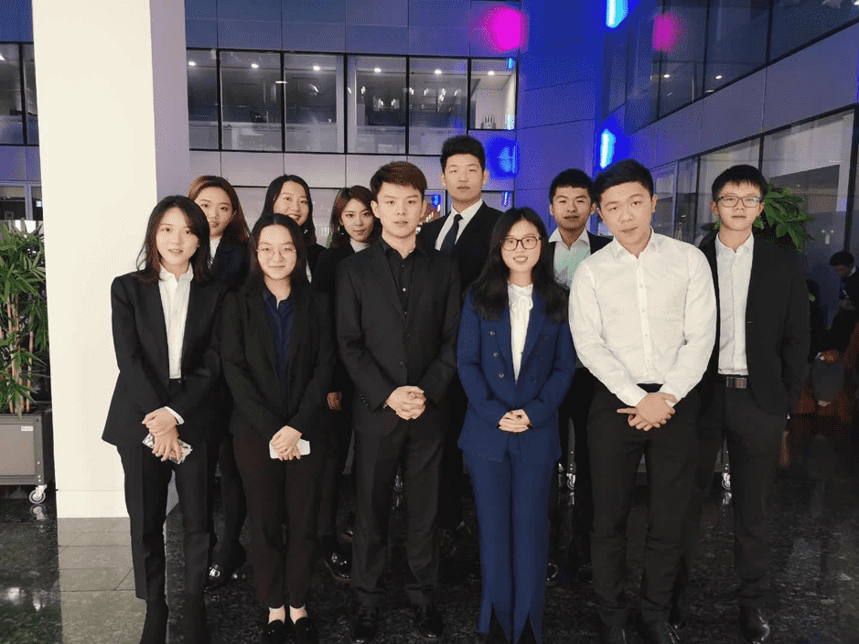

### 体育部

体育部是一个为了丰富同学们课余生活的活动部门，每周举办各式各样的活动，包括篮球单挑赛、卡丁车、跳伞、溜冰、真人cs等。 现有三支校队：篮球队、羽毛球队以及足球队，代表学联参加伦敦及全英国的赛事；更有篮球社、羽毛球社、网球社、跑步社以及女篮社等社团供同学们了解和体验不同的运动。

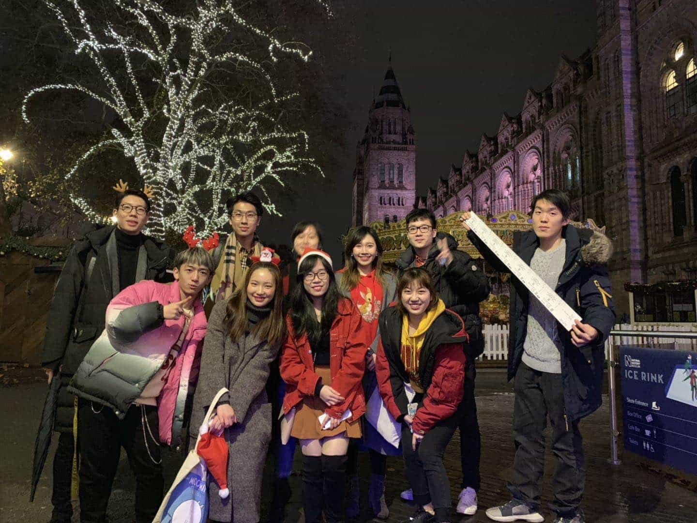

### 事业部

事业部致力于为UCL华人学生提供更多在中英两国顶尖公司的就业机会和求职资讯，主要职能包括定期举办各类求职宣讲会（四大、投行等）、国内顶尖企业招聘会、创业竞赛、创业交流酒会、金融行业以及求职技巧分享会等。

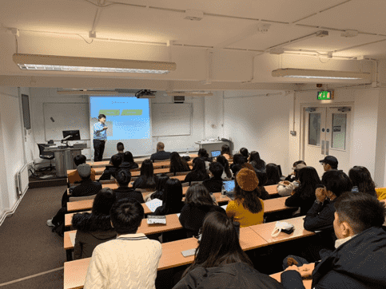 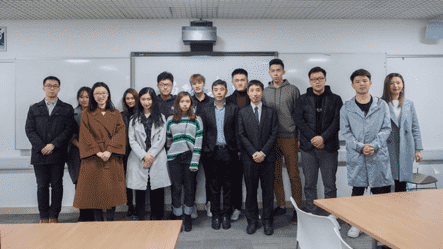

### 文娱部

文娱部负责组织学联活动，为广大在英留学生营造一个舒适愉悦的生活环境，丰富华人学生在英的课余生活，并肩负与其他学校联谊、加深学校之间交流的重任。今年我们举办或协办了参与者多达1500人的Tiger Tiger新生趴、上海新生趴、万圣趴、跑男、假面舞会、新年趴、奇葩说和七天情侣活动，给在伦敦留学的小伙伴们提供了许多交友和在学习之余放松的机会。下一学年我们将在此基础上举办更多更精彩的活动，例如密室逃脱、非诚勿扰、亚洲趴、我要上春晚等等，让同学们学习之余的生活不再枯燥乏味。文娱部是一个锻炼社交能力、组织能力和公关能力的地方，并且是学联的门面担当。如果你有更多更好的创意，擅于与人交谈（或者酒量好、骰子强），文娱部将会是一个给你施展才华的好地方。

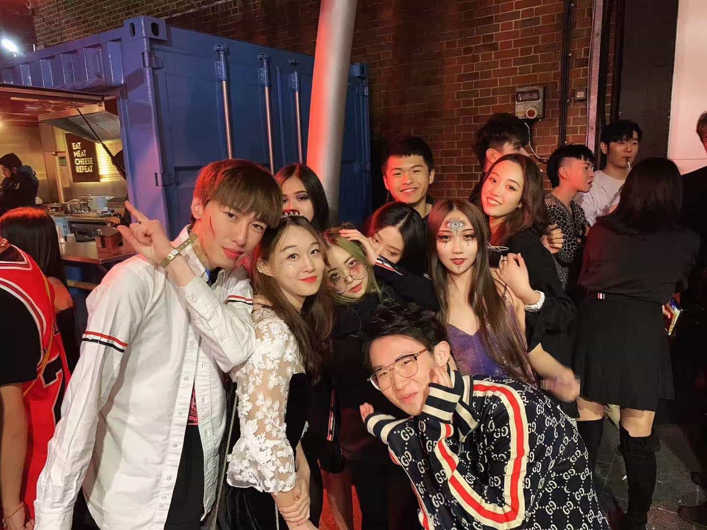 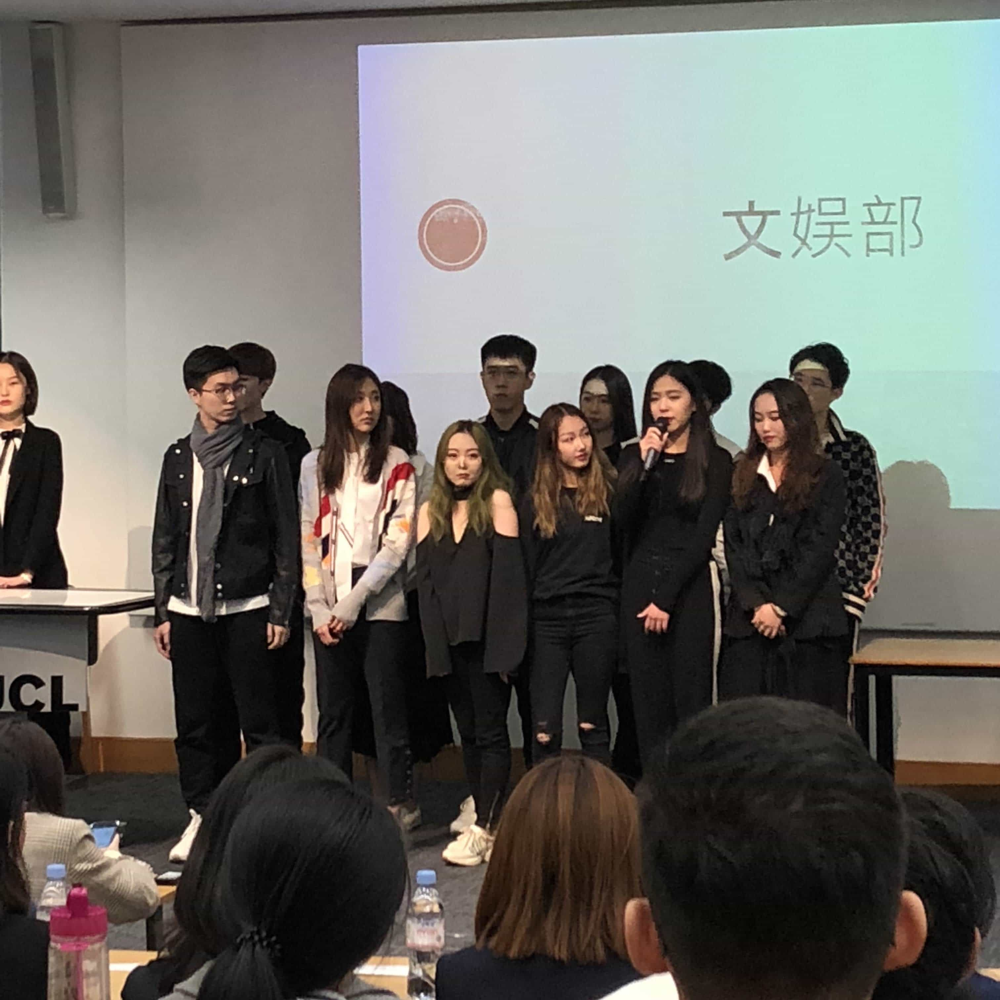 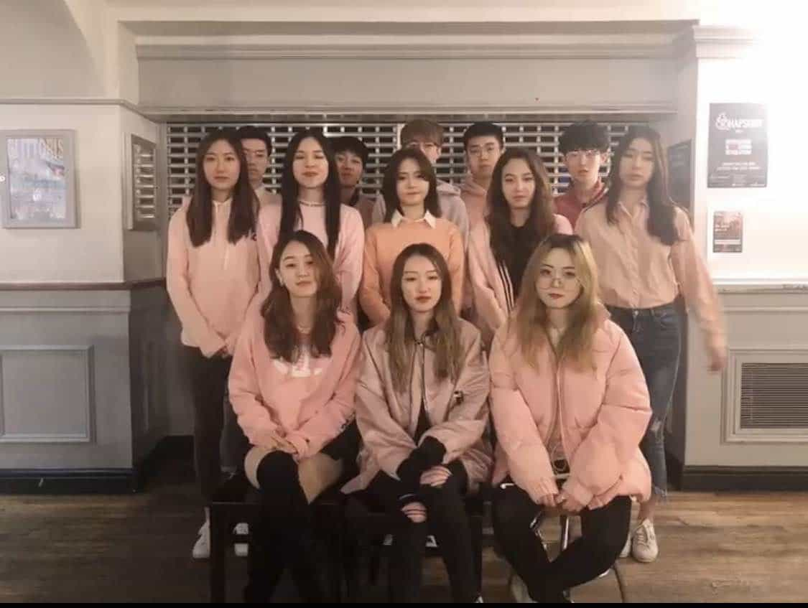

### 文化部

楼外楼，山外山，何为文化部

是每月组织音乐剧的欢聚一堂

亦是元宵庙会的喜气洋洋

更多活动更多精彩

新的一年，我们翘首远望

这里，是文化部

是小姐姐的专注，小哥哥的侧目

联系剧场预定场地

商谈庙会商家赞助

庸俗的话不多说

文化人不哆嗦

做个二货快乐活泼

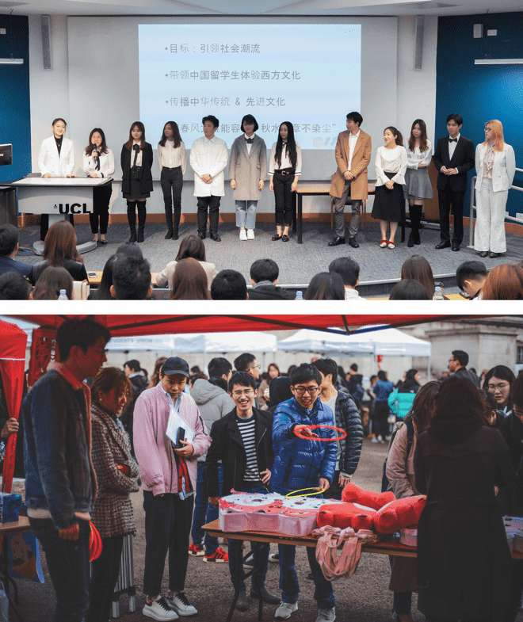

### 宣传信息部

宣传与信息技术部 \(简称宣信部\)，在学联主要负责对外的宣传工作，其中包括学联公众号及各类平台账号的日常运营、撰写活动推送文案、活动前期宣传策划、活动现场摄影及后期、学联官网建设和小程序开发。在学联内，宣信部作为核心部门，与其他部门在工作和活动上都会有紧密的合作。 宣信部同时也是学联与UCL中国学生之间的桥梁，它致力于保证学联与学生之间的高效沟通，及时推送学历最新的活动资讯，同时维持学联的高知名度与参与度。

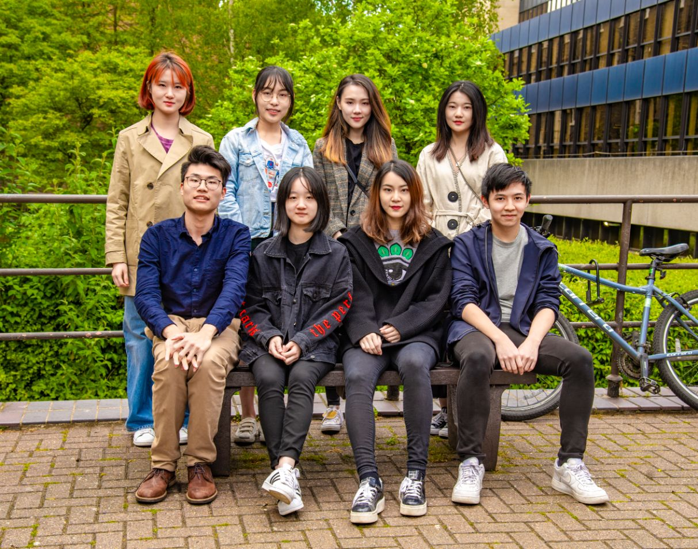

### 中文教育部

中华文化的命脉和血缘，在远离家乡的环境中往往才生长出最蓬勃的生命力。任何发色瞳色的伦敦人都可能对着炎黄面孔的你说出一句“你好”，生涩的口音中包含着对世界上最广泛使用语言的好奇与探求。中文教育部为好奇的他们提供每周的中文课程，在音调汉字的教学中传播中国传统文化。每一个在投影仪前慷慨激昂的中文老师，眼里都有反射回来更热情的光芒。

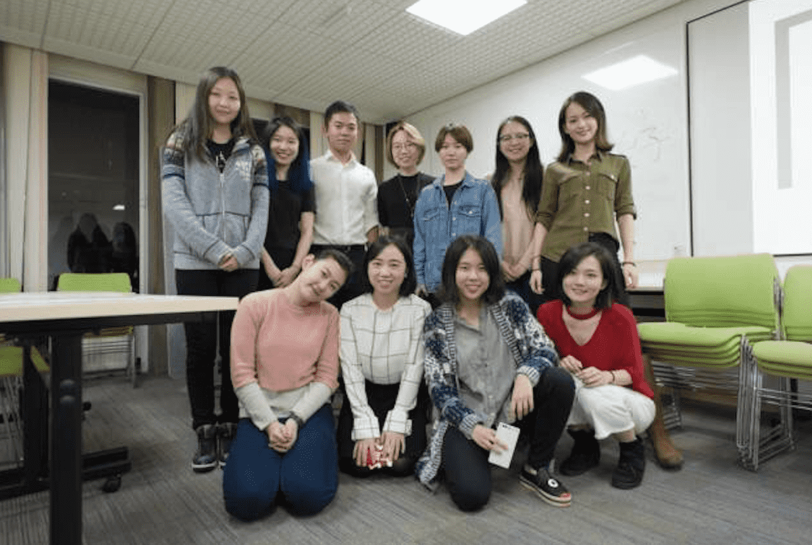

### Ofund慈善部

Ofund（Overseas Chinese Students Children's Fund ）于2007年伦敦成立。作为中国留学生爱心助学基金会，Ofund致力于改善山区贫困儿童的教育现状，并于每年暑期组织在英各大高校学子奔赴贫困地区的中小学进行支教活动。UCL ofund慈善部将会协同各大高校（IC，LSE）举办一年一度的慈善晚会，ofund宣讲会，暑期面试等各种活动，为UCLer提供了解支教，参与支教的良好平台。

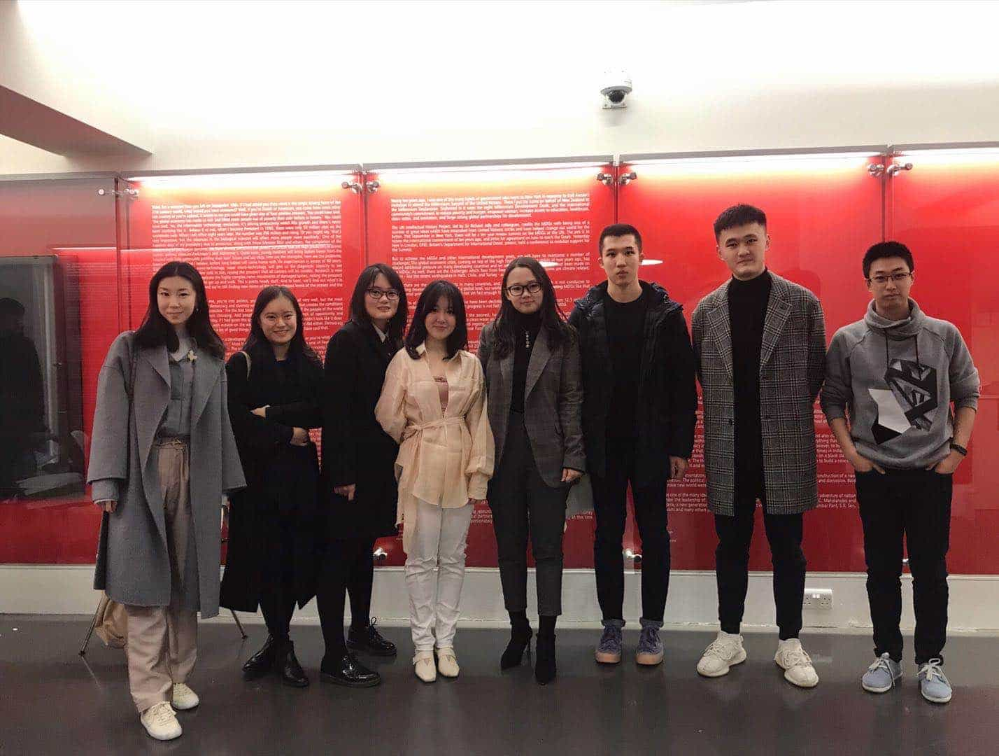

### 艺术团

#### 柒壹•戏剧社

“一个人的一生中扮演着好几个角色，他的表演可以分为七个时期。”——莎士比亚 不论你是戏精还是表演小白，戏剧社都欢迎你的加入！人有喜怒哀乐，正如一年有四季之分。而戏剧人的宗旨就是观察人物、诠释人生。戏剧社将分为四个小组: 导演 & 编剧、演员、道具 & 场务以及摄影剪辑组，每一次活动将由各个小组合作参与并完成各大舞台演出。全年我们都会邀请嘉宾举行讲座，鉴赏中外戏剧作品；戏剧社的年度大戏将会再现大师的经典作品。成天泡图书馆太无聊？考试太累？别担心，花一个周末的时间来和我们拍个微电影吧。独白、对白、剧目……只要你有灵感，只要你有创作的激情，你就是戏剧社需要的人才！

#### Fusion舞蹈队

起床！跳舞！蹦起来！

作为一个高质量的DANCE STUDIO，从“BOOM”的霸气性感到“GOOD NIGHT”的甜美可爱；从编舞炫酷的POPPING到克里斯马满分的HIP-HOP 齐舞；从URBAN的收放自如到JAZZ 的律动爆发，我们都能全方面用力量 HOLD住！在历届演出中，更有民族舞、拉丁舞等多舞种、高难度的表演令人倾心，美不胜收！新的学期里，我们不仅要筹备艺术团新生汇演、去各大高校演出，还会举办我们自己参与其中的DANCE CHOREOGRAPHY，会加入到各种快闪活动以及更大的国际WORKSHOP舞台。我们还将请来专业摄影师定期拍摄、剪辑各种COVER及演出视频，留下精彩瞬间。一起挥汗、一起排练，最后的成果中有每个努力过的我们的身影，是不是非常令人满足和心动呢？如果你热爱舞蹈与艺术，期待遇见你！

#### 仙乐府

2017年仙乐府成立之初，民乐团社员们旨在将国乐之美带向世界，演出曲目包括《高山流水》《鱼》《南山南》等，除此之外更是成功改编了《天空之城》和《欢乐斗地主》插曲，用中国传统乐器展示了它们不一样的美。仙乐府由民乐团和西洋乐团两部分组成，我们重视这两支乐队的融合创新，尝试用西洋乐器展示传统民乐，以及用民族乐器改编西洋乐。不管你擅长民族乐器还是西洋乐器，抑或是有编曲作曲的才气，只要你有想要展示的音乐天赋和创作灵感，那么加入我们吧，我们给你最强大的团队和最耀眼的舞台！请小伙伴们自备乐器，开学后的面试等你来！（不便于携带的大型乐器请私聊咨询）

#### 合唱团

如果你认为合唱队是类似十几人站三排分声部演唱的组织的话，那恐怕我们要让你失望了——这绝不仅仅是一个喜爱唱歌的朋友们一起“合唱“的组织，更是一个凭着对音乐的热爱、对歌唱艺术的志同道合和想站上舞台表演的梦想而聚在一起的歌者联盟！我们满足你站在舞台唱歌，把你的故事通过歌声传递的愿望。在这里，你可以在Ofund慈善晚会、春晚等舞台演唱你喜欢的歌曲；你会接触到乐队；你拥有在伦敦Jenova音乐节表演的机会；你可以参与伦敦好声音比赛，获得在各大学歌唱比赛的机会；你可以和队友合作拍摄音乐录影带并上传YouTube……所以，如果你爱唱歌，就报名UCL合唱队吧！关注招新活动还会有更多惊喜哦。

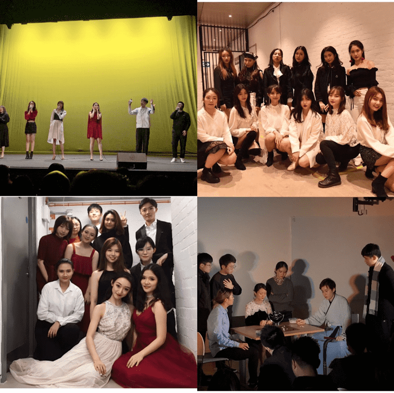

### 辩论队

伦敦大学学院（UCL）华语辩论队于2008年成立，通过近十年的发展，UCL华语辩论队不断成长，广泛参与英国华语辩论的各项赛事并取得了丰硕的成果。近两年曾获得2018捭阖国际辩论赛英国赛区冠军，2018伦敦华语辩论赛冠军，2019年华语辩论世界杯英国赛区冠军。这十年间UCL华语辩论队不断获得了英国各学校的积极支持及好评，这些责任和成绩都是对华语辩论队最好的肯定。

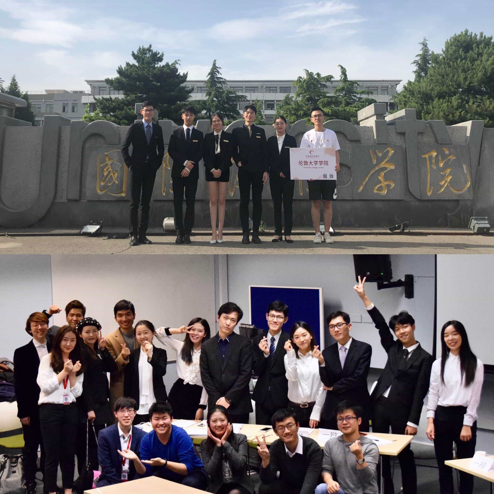

### 春晚

春晚组作为学联兴趣部门之一，负责承办每年的UCL春晚。 组内人员架构为策划、摄制、宣传、场务，分别对应晚会筹办的相关职责。 为呈现出一台完整的晚会，在近两个小时内，歌唱、器乐、舞蹈、语言四大类节目将竞相登场。 2019年，UCL春晚面向超500位观众，由百余位演职人员带来了精彩暖心的表演。

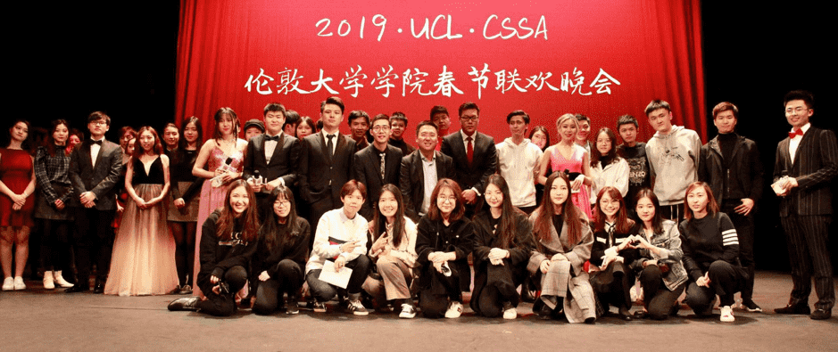

## 加入我们

UCLU Freshers' Fair 2019（时间待定） 更多信息请搜索 `UCLCSSA` 关注官方微信公众号

