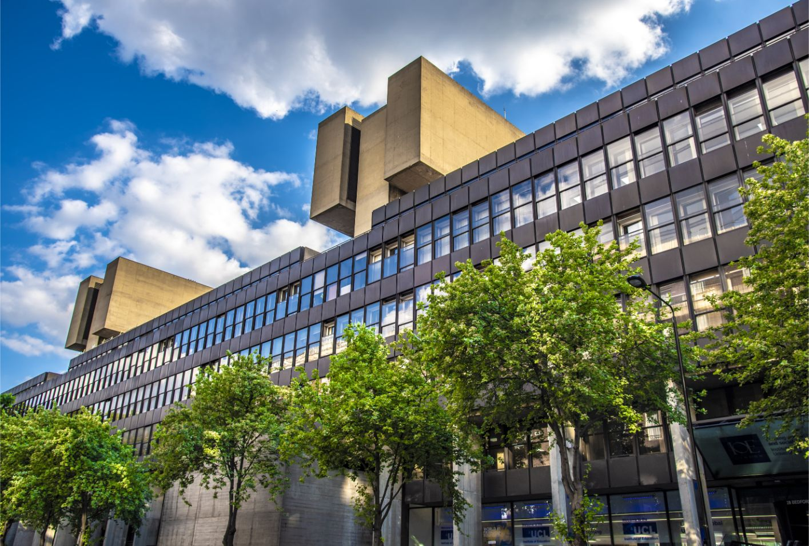

# 初到伦敦

## 租房与住房

[http://www.rightmove.co.uk/](http://www.rightmove.co.uk/) 用于在网上寻找室友合租，需自行联络中介或房东。

[https://uk.easyroommate.com/](https://uk.easyroommate.com/) 用于在网上寻找室友合租，需自行联络中介或房东。

[https://www.foxtons.co.uk/](https://www.foxtons.co.uk/) Foxtons为英国大型房屋租赁公司，价格较高但非常可信。


在英国租房通常签订9个月或者12个月的合同，房客需要缴纳一定的押金并需提前交付房租\(如有担保\) 人则可减少一部分提交缴纳的费用，一些房屋中介允许UCL校方作为学生的担保人, 学生可在入学后向UCL Housing Service提交此类申请\)。


### 租房定金 Deposit

英国留学生住房问题中，最常见的就是房东/中介由于各种原因拒绝返还定金。根据英格兰和威尔士的法律规定\(不包括苏格兰和北爱尔兰\)，2007年4 月6号以后，租房定金需要加入一个protection scheme,目前包括3家机构:The Deposit Protection Service\(DPS\),My Deposit, The Dispute Service\(TDS\)。

具体细则是，房东/中介在收到定金的30天之内，必须把定金放在protection scheme里面，并告知租客相应的序列号\(series number\)和一份定金存证。在租期结束交房之后，租客和中介/房东分别在DPS的网站上填写相关信息，比如房东可以提出从租金中扣除清洁的费用。一旦双方达成一致，协商金额将会退回给租客。如果双方有分歧，租客和房东可分别提交证据，然后DPS会把双方提交的材料交给第三方仲裁。如果仲裁结果还不令人满意，则可以去法院起诉。但是很多案例表示，由于种种原因，在退房之后，房东/中介拒绝退还高额定金。值得注意的是，如果房东/ 中介没有protection scheme的话，一旦找律师起诉，是可以得到3倍定金的赔1業金的。所以如果遇到无良房东/中介，大可放心，一定可以得到应得的定金。

### 租约 Tenancy Agreement

检查你的合同是否是正式合同，而不是精简版合同。\(黑中介会让你签订精简版合同，签订精简版合同的同时也就意味着你签了他们的"正式合同 "。"正式合同"不保护房客权益。你在入住时遇到维修等问题时，黑中介会拿出"正式版合同"与你争执。所以在和房东/中介签订合同的时候，一定要看清楚每一条条款，因为一旦签字合同达成，就具有法律效力，即使合同中有一些不太合理的条款。比如说有些房屋中介的合同条款复杂冗长，而且一些费用的收取都隐藏在一些不明显的地方。另外签订合同时，注意看有没有中止条款\(breakclause\),以防止房东突然停止合同。建议最好在签订合同以前仔细阅读并和房东/中介协商不合理条款。并且在签订合同之后保存好和中介/房东的所有书面交流记录。


学联建议大家在签订合同之前去UCL Rights and Advice Centre让法律顾问审阅合同并提供专业法律意见\(对UCL学生免费服务\)，地点位于Bloomsbury Theatre。


### 财产保护 Property protection

入住前，房东/中介应该提供一份物品清单 \(Inventorylist\),有关房屋内外的设备， 家具，电器等。如果没有提供的话，租客一定要检查设备是否齐全，是否可以正常工作。建议入住前拍下照片，并且有曰期证明是入住前拍照的，以便曰后引起纠纷时作证据。搬出的时候，一定注意打扫干净。如不打扫干净，房东/中介很可能因此拒绝退还部分或全部定金。建议业内的清洁公司进行—次Move-outclean,其中包括地毯的清洁。这种费用通常比被房东/中介罚款要低，而且符合标准。

### 酒店预订

* [https://www.lastminute.com/](https://www.lastminute.com/)
* [https://www.booking.com/](https://www.booking.com/)
* [https://www.hotel.com/](https://www.hotel.com/)

### Unite 学生公寓

Unite集团是英国历史最悠久的学生公寓管理公司，在全英国有超过130多家高档学生公寓，覆盖超过30个城市，Unite集团在伦敦拥有很多大型学生社区，预订指定学生公寓，可获得公寓组织的伦敦一日游活动。其所有的学生公寓都按照现代化的管理模式，拥有24小时电子监控设备。


`价格` 200-320/周价格不等 

`设施` 较好 

`交通` 便利优良 

`网站` [http://www.unitestudents.com/](http://www.unitestudents.com/)


### Nido学生公寓

Nido设计巧妙。提供时尚、现代的膳宿。公寓楼分别坐落于King's Cross, Spitalfield 和 Notting Hill, 均位于伦敦市区的中心地段。学生能方便快捷地到达每个大学和伦敦各处。Nido服务齐全，包括超快速有线\(光纤\)和无线网络宽带、24/7全天候安全保障、室内维修团队、健身房、洗衣服务、公寓打扫。


`价格` 199-400/周价格不等 

`设施` 很好 

`交通` 便利优良 

`网站` [http://www.nidostudent.com/](http://www.nidostudent.com/)


### IQ Bloomsburry

IQ Bloomsburry是坐落在UCL 附近的移动学生公寓。步行到UCL main campus只需5分钟。宿舍内每层都有一到两个不同种类的公共休息室，适合朋友聚会。另外舞蹈室，美术室，游戏屋，音乐房，健身房，洗衣房等设施也很齐全，水电网费都包含在房租里，房间设施很新，屋内都有厨房和浴室，书桌衣柜也都设备齐全。


`价格` 300-500/周价格不等 

`设施` 很好 

`交通` 便利/很便利


## 饮食

* 超市\(价格从高到低〉: M&S,Waitrose,Sainsbury,Tesco
* UCL 餐厅:一个学生餐厅 \(Refectory\) , 4个cafe \(Print Room Cafe, UCLU Cafe, Bloomsbury Cafe, Roberys Building Costs\) , 2个 UCL Shop
* 中国城\(China Town\) 大小商铺错落有致，物品种类齐全，应有尽有。地铁Leicester Square Station. 公交Cambridge Circus \(24,29 路等\)                                 

部分UCLCSSA合作餐厅：

* 锦里20% OFF\(Cash\) 10% OFF\(Card\)；
* 小笼皇20% OFF\(Cash\)
* 花村10% OFF\(Cash\) 
* 峨眉一派12% OFF\(Cash\)，送甜品 
* 老成都15% OFF\(Cash\) 
* 食家庄12% OFF\(Cash\) 
* 巴蜀餐厅15% OFF\(Cash\)，送小菜
* Pizza Toscana 15% OFF

## 通信

* 电话运营商: 02, Labara, Vodafone, 3，Giffgaff, Orange, T-Mobile, Virgin Media, EE...
* 中国电话运营商（更优惠好用）：CMLink \(中国移动，使用EE网络\)
* 签约需要英国的银行卡。在英国办理银行卡之前，可以买pay as you go电话卡\(淘宝网有售\)
* 建议:现在国内开通国际长途业务\(一个月\)
* 网络电话:QQ，Wechat, Skype, Talkbox, Whatsapp, Email

## 支出

* 整体形势:汇率在降，物价在涨
* 奢侈品便宜，曰常生活费用品费用较高
* 注意网络安全，经常检查Online Bank Statement避免诈骗
* 一个月生活费:£500-800 \(不含住宿费\)
* 建议准备好前2个月的生活费\(现金/支票\)

## 交通

### Oyster Card 牡蛎卡

* 伦敦公交地铁不接受现金，仅支持 Oyster 卡或 Contactless \(包括 Apple Pay & Google Pay\)
* Oyster Card 可在任意地铁站机器办理，直接使用现金或银行卡充值。
* Oyster 适用于公交，地铁，轻轨等。也支持办理日票，周票，月票，年票。
* 伦敦地铁历史悠久，线路发达，是城内交通的主力军
* UCL 附近常用的地铁站:Russell square Station, Goodge Street Station, Warren Street Station, Euston Square Station, Euston Station。
* 伦敦巴士，£1.50可在一小时内无限换乘，途径UCL线路: 10,14,24,29,134

### Young person card \(强烈建议申请\)

* 学生折扣\(18 + student\): 入学注册后可申请Student Oyster Card，买月票和年票有折扣
* 一年:£30pp，三年:£70pp。火车票价1/3 off。
* 可与Oyster Card绑定，市内交通折上折\(地铁半价，每曰交通5磅封顶\)
* 请查询: [http://www.16-25railcard.co.uk/](http://www.16-25railcard.co.uk/)

### 其它租车公司

* Addison Lee, 提前预定:www.addisonlee.com 或下载Addison Lee app

### 伦敦自行车

* 自行车并不普及，危险，道路窄，单车道少，价格昂贵
* UCL附近共享单车比较普及，摩拜小黄车1镑20分钟，也有伦敦TfL Docked单车租借。
* 注意购买安全帽等用具
* 学校附近偷车贼较多

## 实用网站

### UCL学习生活

* Moodle: [https://moodle.ucl.ac.uk](https://moodle.ucl.ac.uk)
* ISD: [https://www.ucl.ac.uk/isd/](https://www.ucl.ac.uk/isd/)
* Timetable: [https://timetable.ucl.ac.uk/tt/homePage.do](https://timetable.ucl.ac.uk/tt/homePage.do) 
* UCL Accommodation: [https://www.ucl.ac.uk/prospective-students/accommodation](https://www.ucl.ac.uk/prospective-students/accommodation) 
* UCL Career Service: [https://www.ucl.ac.uk/careers](https://www.ucl.ac.uk/careers)
* UCL library: [https://www.ucl.ac.uk/library/](https://www.ucl.ac.uk/library/) 
* UCL Union: [http://uclu.org/shop](http://uclu.org/shop) 
* 使馆注册: [https://srs.more.edu.cn](https://srs.more.edu.cn) 
* TFL: [https://www.tfl.gov.uk](https://www.tfl.gov.uk)
* National Railway: [https://www.nationalrail.co.uk](https://www.nationalrail.co.uk) 
* Addison Lee: [https://www.addisonlee.com](https://www.addisonlee.com) 
* Young person card: [http://www.16-25railcard.co.uk/](http://www.16-25railcard.co.uk/) 

### 网购

* ASOS: [https://www.asos.com/women/](https://www.asos.com/women/) 
* Amazon: [https://www.amazon.co.uk](https://www.amazon.co.uk)
* Ebay: [https://ebay.co.uk](https://ebay.co.uk)
* Gumtree: [https://gumtree.co.uk](https://gumtree.co.uk) 

### 其他

* 急救电话: 999 \(报案，火灾，急救\) 
* 中国驻英使馆领事部联系方式:Consular Section,电话:\(44\) 020-76311430 
* 网站: [https://www.chineseembassy.org.uk](https://www.chineseembassy.org.uk) 

