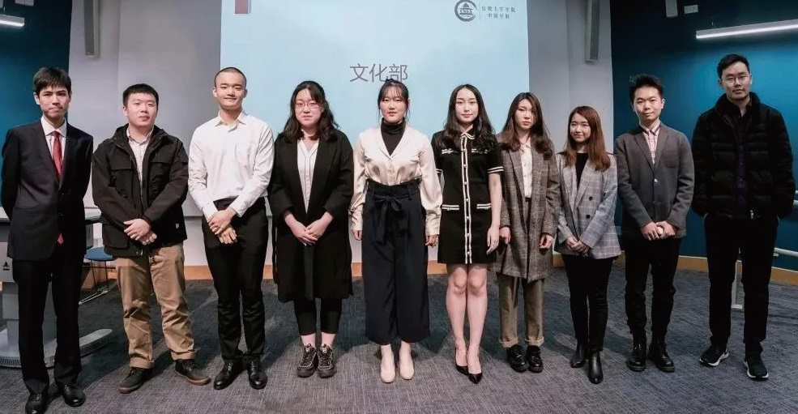

# 伦大学联 UCLCSSA

## 学联介绍

伦敦大学学院中国学生学者联谊会（UCL-CSSA）是一个中国驻英大使馆受中国驻英大使馆指导，且在UCL Union 注册的非盈利性学生组织。伦大学联一直本着全心全意为学生服务的宗旨，致力于丰富学生业余生活，为学生解决生活困难，搭建学生学者交流平台，增进中英两国学术与文化交流，并增强中国学生的凝聚力。长期以来伦大学联得到了驻英大使馆、UCL学生学者以及英国各界华人的广泛关注与认可。

伦大学联一直为中国留学生提供全面的帮助与支持。从留学准备，到在英学习、文体活动， 再到回国就业，学生学者均可在学联找到相关活动或信息。 

除此之外，每年8-9月学联会代表UCL 校方为UCL的新生举办大型的临行准备会， 并发布内容全面的新生手册。该活动以UCL学联为平台，更加紧密的将学生，学联，学校三方结合起来，深化了解，建立高质量的沟通。

## 2020-2021 committee

### 主席团

主席：谈沂鑫 Yixin Tan （james.tan.18@ucl.ac.uk）

副主席：秦明瑄 Kim Qin （kimqmx@gmail.com ）

财务长：吴奕乐 Yile Wu （aloe0228@gmail.com ）

秘书长：张子恒 Henry Zhang （henry.zhang.18@ucl.ac.uk） 

学生事务处书记：吴疆 Jiang Wu （alkaidslight@gmail.com ）

顾问团负责人：张轩畅 Rory Zhang （rory.zhang.18@ucl.ac.uk ）

顾问团负责人：焦谊静Yvette Jiao （zcakiao@ucl.ac.uk）

### 职能部门

外联部部长：胡寅瑞 Yinrui Hu （yinruihu@gmail.com） 

事业部部长：张可源 Keyuan Zhang （zceekz0@ucl.ac.uk ）

宣传信息技术部\( 宣信部\) 部长：张璐佳 Lujia Zhang （zcrhlzh@ucl.ac.uk ）

文化部部长：李袁坤 Yuankun Li （liyk0104@163.com ）

文娱部部长：梁汉森 Honsum Liang （zctphsl@ucl.ac.uk ）

体育部部长：刘晓林 Xiaolin Liu （a1874165076@hotmail.com）

### 兴趣部门

中文教育部部长：周泠仪 Lingyi Zhou （cimary\_mandarin@outlook.com ）

艺术团团长：刘鼎霖 Dinglin Liu （zcah005@ucl.ac.uk ）

辩论队队长：韩歆玥 Vicky Han （Vicky.han.19@ucl.ac.uk Ofund）

慈善部部长：张晓雯 Xiaowen Zhang （niclezhang1024@gmail.com ）

春晚总监制：陈姝羽 Shuyu Chen （zctpheh@ucl.ac.uk ）

春晚总导演：叶香杉 Xiangshan Ye （beatrice.ye.19@ucl.ac.uk）

## 部门介绍

学联下属了诸多职能部门与兴趣部门，每一个部门都会践行学联的宗旨，尽力满足大家在学习、生活、娱乐方面的各种需求，也让每一位参与学联的同学找到自己独特的价值。

### 外联部

外联部负责学联一切的对外联系工作，主要通过与国内外各大企业以及其他相关机构进行商业推广合作，为学生们的日常留学生活提供便利和支持。作为学联资金支持的主要来源，外联部日常工作有与公司或其他组织进行商谈，审核并签署合作合同，以此来帮助同学们与外界企业、机构建立起联系。其中进行商谈的机构中既有世界500强企业，也有和学生们日常生活衣食住行息息相关的各个商家。让更多的学生们能够受到优惠和便利，并开拓、加深了学联与各大企业即其他社会团体的联系，是外联部长期以来的宗旨。

### 事业部

伦大学联事业部致力于联合各大海内外知名企业和已在企业中工作的优秀校友伙伴，为UCL的学生提供一流的人脉资源以及就业、创业机会。我们每一年都在为创立新的活动形式，提升活动质量而努力。在2019-20学年，事业部除了举办由华为、美的等世界500强名企到校举办的线下招聘会，还为学生提供许多更加接地气的活动：Spring Week申请前的个人简历修改大会，流量经济时事论坛以及年度创业大赛都受到了参与者的一致好评。 事业部的活动与每一年的求职时间线紧密结合，不论刚刚入学的新生同学还是即将毕 业的老生，关注事业部的活动动态即可理清你的求职思路。我们希望每一场活动都能够扫除一些你对实习申请过程中的担忧与困惑， 点亮你未来人生规划的道路。

### 文娱部

文娱部的宗旨是为我们中国留学生在国内外组织各种各样的学联活动。我们的目的是为了给大家的繁忙的学习生活中带来更加丰富的生活以及提供一个结交各路好友的平台。提起去年文娱的工作，我们主办了全伦敦最大的新生派对（高达1500人次的Tiger Tiger新生趴），也在国内与其他英国高校合办了两次新生派对，并在伦敦举办了各种节日性质的派对，以及举办了线上好声音，还有非诚勿扰和七天情侣这一类的交友性质的活动。文娱部的工作非常锻炼社交能力，组织能力以及公关能力。如果你是一个有好的创意，喜欢交际（我们经常与其他学校的文娱部联谊）的同学的话，享受在颜值极高的环境下（我们的部员颜值都是数一数二的哦）工作的同学，文娱将非常欢迎你的加入！、

### 文化部

文化部的核心宗旨是提升同学们的精神生活。每一年的元宵庙会都是一场盛事，另外定期推出的伦敦各大剧场的音乐剧欣赏和歌单影单推荐也会受到广大同学的持续关注。今年我们举办了书信交友、微电影放映会、language exchange等新鲜活动，文化部致力于发现身边的美好和同伴们的才华，有趣的灵感会在这里得到实现。文化部的服务对象不仅限于UCL的中国留学生，自身也在努力搭建一座中西方文化交流的桥梁。文化部是学联的佛系担当，也是锻炼灵感迸发力、活动组织能力的地方。文化部期待在已有传统活动的基础上，和大家共同经历更多新鲜很酷的精彩活动。

### 宣信部

宣传信息技术部\(简称宣信部\) 主要负责学联的宣传工作。宣信部致力于与学生间建立高效的沟通，及时且高质量传递学校资讯与活动信息。宣信部由文案排版组，设计组，摄影组，信息技术组四个组构成。作为学联人数最多，组别最丰富的部门，宣信部融合了多种多样的小伙伴。无论你是喜爱文字，爱好摄影，擅长设计，还是一枚IT大佬， 都可以在这里找到属于你独一无二的位置。

### 体育部

体育部是一个开设运动社团以及组织相关娱乐活动的执行部门。今年体育部预计开设篮球社，羽毛球社，女篮社，网球社，跑步社，足球社和电竞社等社团供大家选择，各个社团将会定期举行校内外联赛，在这里你可以一展风采，为团队胜利拼搏。去年成功举办的优秀活动也会在今年得以延续，例如，可以使各位“胆小鬼们”亲身浸入在节日气氛中的万圣节第五人格游戏；在温暖而又浪漫的圣诞树下见证情谊的圣诞溜冰惊喜派对；在风驰电掣中体验秋名山车神的卡丁车竞速赛；为在“team”中只看到“me”的大神们展示球技的单打毒斗1v1篮球赛。而且更有马术，跳伞等活动也会在明年开展。在这里你可以发现，有很多有趣而又充满活力的伙伴可以结识，让你对伦敦的记忆不止停留在学校里，而更是在这享受蓝天白云，生气蓬勃的自然生活之间。期待不久的将来能与你在体育部这个大家庭相见！

### 艺术团

伦大学联有一支仙气十足的团体，艺术团。艺术团作为伦大学联最大的兴趣部门，共由五个部门组成：合唱队、乐团、韩舞队、民舞队和戏剧社。每个部门都有每周固定的排练时间，也有大量的演出机会。艺术团也会组织各式各样的团建活动，为所有成员们营造一个开心放松的氛围。我们不仅是每年大大小小演出（春晚、Ofund） 的主力军，这里更是聚集了很多志同道合、 有相同爱好的有趣灵魂。 所以，不论你是KTV 的优秀麦霸、舞池里的瞩目舞王、才华横溢的乐手还是舞台上的戏精本精，艺术团一定会是你的一个最温暖的家。

### 中文教育部

中华文化的命脉和血缘，在远离家乡的环境中往往生长出蓬勃的生命力。任何发色瞳色的外国友人都可能对着炎黄面孔的你说出一句“你好”，生涩的口音中饱含对中文的好奇与渴求。自2010 年起， 中文教育部（UCL CSSA Mandarin Classes）每 周为外国友人提供免费中文课程，同时开展迷你中国文化节、汉语小课堂、趣味街访等寓教于乐的活动，在B 站、Youtube、Facebook 等平台收获了大量关注。今年始创的“心行省幸”公众号的编排工作也在紧锣密鼓地进行中。

### 春晚组

春晚组作为学联兴趣部门之一，负责承办每年的伦大春晚。组内人员分别担任策 划、摄制、宣传、场务，各司其职又团结一致， 组成了学联最热闹和谐且最爱团建的团队之一。 从初步主题的策划到宣传片的拍摄，从 海选到彩排，从周边的定制到票务的售卖， 从设备租借到舞美编排，只要你想，舞台的每个角落都可以由你搭建。2020 年鼠年伦大春晚，经过百余位演职人员的努力，在周杰伦，黄渤，雷佳音，胡彦斌等明星的祝福下拉开序幕并圆满举办，为观众带来了器乐、语言、声乐、舞蹈等精彩多样的表演。 如果你也热爱舞台幕后，热爱中国文化，脑洞无限且具有团队精神，春晚组欢迎你！！！

### 华语辩论队

伦敦大学学院（UCL）华语辩论队于200 年成立，通过数十年的发展，UCL华语辩论队不断成长，广泛参与英国华语辩论的各项赛事并取得了丰硕的成果。近两年曾 获得2018 捭阖国际辩论赛英国赛区冠军， 2018、2019、2020 三届伦敦华语辩论赛冠军，2019、2020 年津英杯冠军，2019 年华语辩论世界杯英国赛区冠军，2020年世界华语辩论锦标赛季军以及2020 年世界华语思辨奥林匹克季军。这十年间UCL 华语辩论队不断获得了 英国各学校的积极支持及好评，这些责任和成 绩都是对我们最好的肯定。

### Ofund 慈善部

Ofund（Overseas Chinese Students Children’s Fund ）于2007 年伦敦成立。 作为中国留学生爱心助学基金会，Ofund 致力于改善山区贫困儿童的教育现状，并于每年暑期组织在英各大高校学子奔赴贫 困地区的中小学进行支教活动。 UCL ofund 慈善部将会协同各大高校 （IC，LSE）举办一年一度的慈善晚会， ofund 宣讲会，暑期面试等各种活动，为 UCLer 提供了解支教，参与支教的良好平台。

#### 

#### 招新对象

所有伦敦大学学院注册学生 （本科/ 硕士/ 博士）

#### 招新时间

2020 年9 月底～ 10 月初

#### 招新形式

填写申请表并发送至指定邮箱等待邮件回复面试届时会发布正式招新推文请持续关注UCLCSSA公众号，我们期待你的加入！

## 学联宣传平台

### 公众号

公众号推文一直以来都是学联最主要的宣传平台，更新频率为每日。在这里，你可以获知学联最新的活动及福利、UCL 的资讯新闻、有价值的留学信息，了解英国文化，听见不一样的观点，领略更广阔的世界。

### 微博

请搜索“UCLCSSA”找到此微博账号。伦大学联官方微博会不定期为大家推送学联。最新活动，宣传视频及征稿美图。

### 官方网站

[https://www.uclcssa.org](https://www.uclcssa.org) 

想要了解学联的最新活动？想要更全面的了 解学联？想要查找学联的部门介绍，找到最 合适自己的部门？想要看往期所有学联活动的视频及录像？学联官网丰富的内容和帮助信息，帮助你解决各种需求！ 此外，近期官网重磅上线COVID-19 实时疫 情动向栏目，与你共同关注英国疫情最新动态，轻松获取最新疫情数据。

### 小程序

小程序在手，走遍UCL 无敌手！小程序几乎具备了你在UCL 校园需要的一切功能，不管 是查询图书馆实时余位，查看专属你的UCL 课表；还是发布二手闲置、房屋信息，搜索 UCL 学生及职工姓名；亦或是查看Tfl 交通 状态，查看周边美食...... 只有你想不到的功能， 没有小程序不具备的功能！ 此外，近期小程序重磅上线COVID-19 实时 疫情动向栏目，与你共同关注英国疫情最新 动态，轻松获取最新疫情数据。在小程序首页点击订阅，还可以每日第一时间获取疫情 实时更新提醒哦！

### Instagram

uclcssa\_official

伦大学联官方Ins 充满着伦敦和UCL 的美图，是摄影爱好者们不可错过的宝藏账号！关注学联Ins，看看大家记录生活的独家视角吧！

