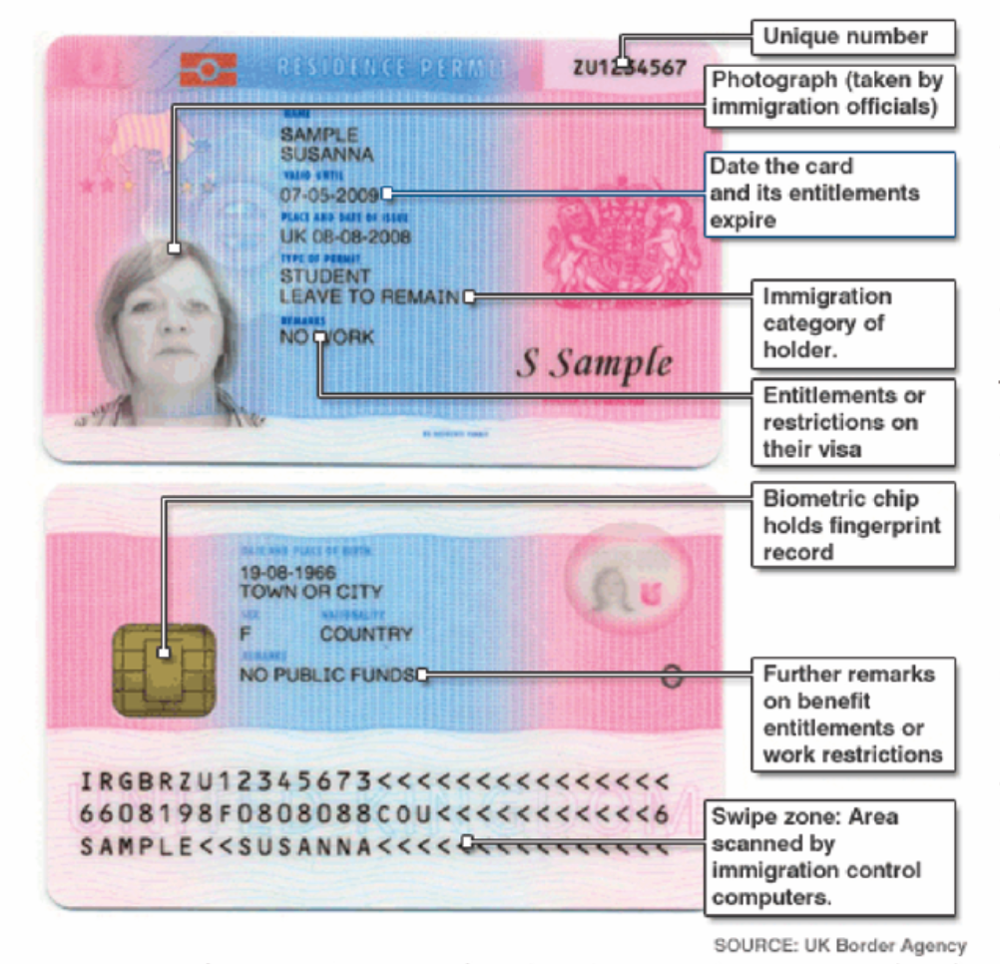

# 初到伦敦

## 入住

请在入住前提前查找好宿舍前台的工作时间, 联系方式以及具体地址，以免发生入住时无人值班或无人联络的情况。如若飞机落地时间与宿舍前台工作时间有出入，或飞机临时晚点，请务必提前与前台进行沟通。

UCL 宿舍入住需要携带 Confirmation Letter & Deposit Receipt，校外学生公寓入住则必要携带 Proof of ID。同时过海关时携带的核酸阴性检测结果、乘客座位表也有可能被要求查看。

从中国出发的同学需要在宿舍自我隔离10天，所以请提前与宿舍方沟通好隔离细则。疫情期间宿舍入住政策以及要求携带的文件会随疫情状况及政府政策有所调整，请定时刷新查看，以免发生遗漏。

## 隔离政策

在英国目前实施红绿灯政策中，中国被列于黄色名单。需自我隔离十天，并在第二天和第八天分别进行两次COVID-19检测。登陆GOV.UK预定检测包（应该在入境前就完成），供应商会直接将检测包邮寄到你的地址，你也可以选择前往检测中心进行检测。

如第二天检测结果为阴性，你可以在第五天时额外支付一次COVID-19检测包，结果为阴性就可以提前结束隔离。

### 检测包

一份COVID-19检测包包含：采样棉棒，样品试管（已贴好标签），快递瓶，透明密封袋，邮寄使用的白色包装袋和快递袋；使用手册。

使用指南

1. 使用肥皂或洗手液认真洗手20秒以上；
2. 打开检测包，检查内含物品是否齐全并且包装完好；
3. 撕开棉棒包装，使用棉棒先在咽喉，然后在鼻腔分别进行取样；
4. 将采集好样本的棉棒放进样品试管，按指示线折断多余的棉棒，并盖紧试管盖子；
5. 再次认真洗手；
6. 将样品试管放进快递瓶里面；
7. 将快递瓶子放进透明密封袋里面，并密封好袋子；
8. 登录[www.randoxhealth.com/register-kit](http://www.randoxhealth.com/register-kit)注册URN序列号；
9. 将密封袋放回检测包盒子中；
10. 将检测包盒子放入白色回邮包装袋中；
11. 将白色回邮包装袋放进黑色已贴邮资的回邮快递包装袋里， 并记录下邮包上的tracking number；
12. 找到距离最近的邮局红色邮筒\(Post Box\)投递出去。登录[www.postboxes.dracos.co.uk](http://www.postboxes.dracos.co.uk)查询，就可以找到离自己最近的邮筒；
13. 快递寄出后登录：[www.royalmail.com/track-your-item\#](http://www.royalmail.com/track-your-item#)， 输入邮包上的tracking number可以查询快递状态。

## Enrollment

在结束隔离后，你可以通过UCL官网预约领取学生卡的时间，并前往UCL主校区进行领取。请确保前往学校时携带了护照等身份证明，或是BRP（如果已经领取）。校园内几乎所有建筑都需要通过刷卡通行，图书馆借书也需要使用学生卡，所以请务必妥善保管。

## 领取BRP

申请签证时，如果在Alternative location一栏填写了UCL的 Alternative Collection Location code\(2HE484\)，你的BRP会先送到UCL。抵达英国后，登录Portico，上传护照英国签证页贴纸，确认你目前的英国地址，包括邮编、邮箱和电话。UCL将会在确认信息后，通过皇家邮政专递送到你的宿舍。但随着今年线下课程开放，可能会开放到学校领取BRP的选项，学联将持续更新学校政策。

如果没有填写UCL的ACL code，BRP将会被送到离你的地址最近的邮局。当你的BRP可以从邮局领取时，UCL将不会联系你，你需要自己安排领取。前往邮局领取时请携带护照及UKVI的决定信（decision letter）。

## 注册GP

签证时所缴纳的医疗附加费（IHS）确保你在英国的医疗保障。所有新生都应该在开学的几周内注册GP（General Practitioner, 类似于中国的社区健康中心）。GP 注册完成后会得到自己的 NHS number，也就是医保号。这是在去医院看非急诊，以及享受免费看意外受伤，突发病症时的凭证。

Ridgmount Practice是UCL合作的GP机构，距离校园也最近。但如果住宿地点离学校比较远的话，建议还是查询离自己住址最近的GP机构。在网上填写完注册表后，携带学生卡和学生状态声明信现场注册。


_**Ridgmount Practice**_

地址：8 Ridgmount St, London WC1E 7AA

距离UCL主校区步行10分钟


## 警局注册

从中国前往英国留学的新生都必须完成警局注册，且**必须在入境七天内完成线上预约**。


_**Overseas Visitors Records Office \(OVRO\)**_

323 Borough High Street, London SE1 1JL

由UCL主校从Euston站上车，搭乘地铁Northern线约26分钟分钟抵达


### 线上预约

使用你在英国的居住地址邮编或是UCL主校区邮编（WC1E 6BT）注册OVRO账号。输入自己的个人相关信息并提交一张清晰的证件照。提交表格后，你将需要预约一个线下前往OVRO的时间段。开学季注册新生较多，很可能会预约到几周甚至一个月后。

tier 4 student visa和新的student visa均在“Student”分类中。填写表格过程中，如果VAF和BRP号显示字数不够，请在前面加上一个“0”。表格的“tutor contact”部分，若还不知道自己的tutor，请发邮件联系自己的部门。

### 线下注册材料准备


准备材料时可以点击左侧的勾选框对照确认材料是否带齐哦


1. [ ] 护照
2. [ ] BRP
3. [ ] 住宿地址证明（宿舍Offer或是租房合同）
4. [ ] 在读证明（学生状态声明信或是CAS）
5. [ ] 预约证明，如邮件
6. [ ] 信用卡、借记卡或是手机支付34镑注册费


**目前OVRO不接受现金！必须使用信用卡、借记卡或是手机支付**。


## 银行开户

英国海关允许携带最多£10,000入境英国。

### 开户材料准备


准备材料时可以点击左侧的勾选框对照确认材料是否带齐哦


1. [ ] 带有签证页的护照
2. [ ] BRP
3. [ ] 在读证明（学生状态声明，必须在完全完成注册后再从portico下载打印）
4. [ ] 住宿地址证明（请务必将term-time address更改为英国居住地址，因为银行卡将会直接快递到你所填写的地址）
5. [ ] bank letter（完全完成注册后从portico下载打印）

