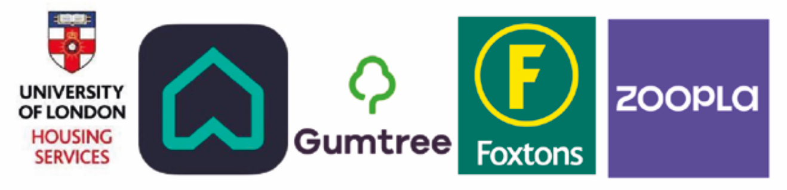
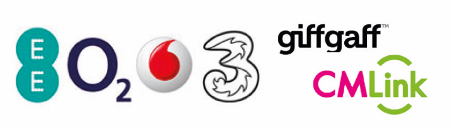

# 行前准备

## 签证

如果是正课或是任何大于六个月的课程，签证类型为Student Visa；如果是语言班等小于六个月的课程，签证类型为Short-Term Study Visa。

### 申请过程

首先线上进行申请，申请时按照个人信息填写表格，最后需在线支付签证费及医疗附加费（Immigration Health Surcharge, IHS\)。签证费为£348，加急五天和两天分别为£568和£1,340。IHS费用为每年£470。

预约合适的时间及签证中心，线下递交护照和资料，并进行生物信息采集（指纹及拍照）。

### 所需材料


准备材料时可以点击左侧的勾选框对照确认材料是否带齐哦


1. [ ] CAS：在获取无条件录取后，学校将会给每一位新生发放CAS（Confirmation of Acceptance for Studies），获得CAS后方可以进行签证申请
2. [ ] 护照
3. [ ] 换取CAS时提供的证书，包括语言成绩、考试局成绩、毕业证、学位证等
4. [ ] 可能会被随机抽查到的存款证明，定期或活期皆可，必须存满28天且金额不低于 **能够支付一年学费+生活费的金额**
5. [ ] 肺结核检查证明，有效期六个月
6. [ ] 部分研究生理工课程需提交ATAS证书
7. [ ] 未满18岁需提供与父母的关系证明及同意书
8. [ ] 成功在线支付签证费用及医疗附加费用确认电子邮件的打印件


注：各项证明材料都需要 **翻译成英文** ，翻译件必须是对原材料的正确翻译，写明翻译日期，译者的名字、签名和联系信息。


### 面试

可能会被随机抽查到视频面试，此随机面试只是一个确保申请者的确是以赴英学习为目的的保障措施，正常应答即可。

## 海关


准备材料时可以点击左侧的勾选框对照确认材料是否带齐哦


### 赴英前准备

1. [ ] 预约抵达英国第二天及第八天的COVID-19检测包；
2. [ ] 抵达英国前48小时填写乘客座位表，提供联系方式及航班信息；
3. [ ] 提供赴英前三天内的COVID-19检测阴性证明，语言需为英语、法语或西班牙语。

### 过关材料准备

1. [ ] 护照或其他身份证明
2. [ ] 护照首页复印件，签证页复印件
3. [ ] 三天内的COVID-19检测阴性证明
4. [ ] 入境后COVID-19检测包的预约确认信
5. [ ] 打印的乘客座位表
6. [ ] 录取通知书
7. [ ] CAS
8. [ ] 资金证明
9. [ ] 住宿地址证明（宿舍offer或是租房合同
10. [ ] 学术证明
11. [ ] 肺结核证明
12. [ ] 《国际旅行健康检查证书》（_小红本_），《国际预防接种证书》（_小黄本_）


《国际旅行健康检查证书》与《国际预防接种证书》并不是必须，但被抽查到会需要在机场进行临时体检。


## 宿舍

UCL保证为第一年入学的新生提供宿舍，前提是满足：

| 学位 | 条件 |
| :--- | :--- |
| 本科生 | firm了UCL的offer，在5.31前提交宿舍申请，以前没有在伦敦学习或生活过 |
| 研究生 | 接受了UCL的offer，在6.30前提交宿舍申请，以前没有在伦敦学习或生活过 |

### 宿舍房型

| 宿舍房型 | 描述 |
| :--- | :--- |
| Single | 一人独享一间房间，与其他人共享卫生间与 厨房。房间内自带洗手池。 |
| Twin | 两人共享一个房间 , 每人一张单人床。与他人共享卫生间与厨房，价格便宜。 |
| En-Suite | 房间内自带卫生间和淋浴，与其他人共享厨房。因为自带独立卫浴，是最热门的房型。 |
| Studio | 房间内自带卫生间和厨房，价格偏高。 |

### 餐食类型

| 餐食类型 | 描述 |
| :--- | :--- |
| Catered | 一周提供12餐，费用已包含在住宿费用里。其中周一至周五是早餐和晚餐，周末为早午餐（brunch）。宿舍无配套厨房设施。 |
| Non-Catered/Self-Catered | 自炊宿舍，学生需要自己做饭。厨房设施齐全，包括炉灶、抽油烟机、烤箱、冰箱等。 |

## 租房

通过租房平台寻找英国本地房源也是一种在英住宿的办法。好处是地理位置、房型大小都可以自己选择，且租房面积较大。但需要自己负责bills，部分房源没有前台，且需要签署系列文件，风险较高。

### **找房平台**

在英国留学生比较常用的平台有：University of London Housing Service，Right Move，Gumtree，Foxton，Zoopla

遇到喜欢的房子可以给房东或是中介发信息和留言，请求多发一些房子内部与周围的照片，合适的话可以预约看房。今年由于疫情很多平台和中介都取消了线下看房，但是会提供视频或是VR看房。


**找房看房时可以考虑的一些问题：**

* 是否包bill？不包bill的话怎么交水电费？
* 是否有监控和门禁？
* 前台是否是24h服务的？
* 是否允许养宠物？
* 是否允许转租？
* ...

其他任何关心的问题也务必在签合同前问清楚。


### **签订合同与支付押金**

1. 要仔细检查合同，有疑问要及时提出，若自己拿不定主意可以找专业人员帮忙检查。
2. 看合同时要注意中止条款（break clause），防止房东突然中止合同。
3. 支付押金时要先询问房东使用的是哪个押金保护项目。法律要求房东必须将押金放进一个保护项目，而英国押金保护项目有三个Deposit Protection Scheme，My Deposit和Tenancy Deposit Scheme，提前询问可以避免退房时的押金纠纷。房东 / 中介在收到定金的 30 天之内必须把定金放在保护项目里面，并给告知租客相应的序列号 \(Series Number\) 和一份定金存证在租期。结束交房之后租客和中介 / 房东分别在 DPS 的网站上填写相关信息，比如房东可以提出从租金中扣除清洁的费用。一旦双方达成一致，协商金额将会退回给租客。如果双方有分歧，租客和房东可分别提交证据然后 DPS 会把双方提交的材料交给第三方仲裁。如果仲裁结果还不满意则可以去法院起诉。
4. 付款后要及时与房东/机构确认是否收到款项，保存好转账和确认收款的证明。
5. 作为学生可以免除Council Tax，需要提前告知房东。

### **入住**

1. 提前告知房东具体入住时间，确定钥匙或房卡的领取方式。
2. 入住后房东会找人或要你自行填写房屋报告，包括房屋内家具、电器的状态。若屋内有任何设施损坏一定要如实记下，不然退房时会被罚款。
3. 不包bill的房子可以在入住时记下水表电表读数，同时入住前进行拍照，避免日后引起纠纷。
4. 要向房东询问常用的各类维修电话，如有前台，也要记下前台电话。
5. 入住后有什么问题都要及时与房东联系。

### **退房**

1. 根据签订合约时break clause的要求提前告知房东将要离开。
2. 离开前检查各类设施是否有损坏，把房子整理干净。
3. 不包bill的房子可以在离开时记下水表电表读数。

## 学生公寓

除了从平台进行租房，也可以考虑在伦敦私人运营的学生公寓品牌。这些品牌往往都是连锁的，在伦敦各大高校附近会有多栋公寓，非常可靠。房型以en-suite和studio为主，配套24小时前台、自习室、娱乐设施等，房租里也已包含了bills。

但是，学生公寓的布局较为紧凑，房间较小，价格相较于校内宿舍也昂贵一些。

UCL附近的学生公寓品牌有：Unite Student，Chapter，Urbanest，IQ，Scape，Downing Students

### 三种住宿形式对比

<table>
  <thead>
    <tr>
      <th style="text-align:left"></th>
      <th style="text-align:left">&#x6821;&#x5185;&#x5B66;&#x751F;&#x5BBF;&#x820D;</th>
      <th style="text-align:left">&#x6821;&#x5916;&#x5B66;&#x751F;&#x516C;&#x5BD3;</th>
      <th style="text-align:left">&#x6821;&#x5916;&#x79DF;&#x623F;</th>
    </tr>
  </thead>
  <tbody>
    <tr>
      <td style="text-align:left">&#x4F18;&#x70B9;</td>
      <td style="text-align:left">
        
&#x901A;&#x8FC7;&#x5B66;&#x6821;&#x7CFB;&#x7EDF;&#x7533;&#x8BF7;&#xFF0C;&#x6D41;&#x7A0B;&#x7B80;&#x6D01;

        
&#x5BBF;&#x820D;&#x5185;&#x57FA;&#x672C;&#x4E3A;UCL&#x540C;&#x5B66;&#xFF0C;&#x6BD4;&#x8F83;&#x5B89;&#x5168;&#x4E14;&#x53EF;&#x4EE5;&#x8BA4;&#x8BC6;&#x5F88;&#x591A;&#x6821;&#x53CB;

        
&#x4EF7;&#x683C;&#x76F8;&#x8F83;&#x53E6;&#x4E24;&#x79CD;&#x65B9;&#x5F0F;&#x66F4;&#x4FBF;&#x5B9C;

        
&#x5F80;&#x5F80;&#x79BB;&#x5B66;&#x6821;&#x8F83;&#x8FD1;

        
&#x4EA4;&#x8D39;&#x65B9;&#x4FBF;&#xFF0C;&#x5305;bills

      </td>
      <td style="text-align:left">
        
&#x5730;&#x7406;&#x4F4D;&#x7F6E;&#x3001;&#x623F;&#x578B;&#x548C;&#x4EF7;&#x683C;&#x90FD;&#x53EF;&#x4EE5;&#x81EA;&#x5DF1;&#x51B3;&#x5B9A;

        
&#x8BBE;&#x65BD;&#x914D;&#x5957;&#x9F50;&#x5168;&#x800C;&#x4E14;&#x6BD4;&#x8F83;&#x65B0;

        
24&#x5C0F;&#x65F6;&#x524D;&#x53F0;&#x3001;&#x5B89;&#x4FDD;

        
&#x5927;&#x90E8;&#x5206;&#x90FD;&#x4F1A;&#x6709;&#x81EA;&#x4E60;&#x5BA4;&#x3001;&#x4F11;&#x95F2;&#x5BA4;&#xFF0C;&#x90E8;&#x5206;&#x8FD8;&#x4F1A;&#x914D;&#x5907;&#x7535;&#x5F71;&#x9662;&#x3001;&#x82B1;&#x56ED;

        
&#x4EA4;&#x8D39;&#x65B9;&#x4FBF;&#xFF0C;&#x5305;bills

      </td>
      <td style="text-align:left">
        
&#x5730;&#x7406;&#x4F4D;&#x7F6E;&#x3001;&#x623F;&#x578B;&#x548C;&#x4EF7;&#x683C;&#x90FD;&#x53EF;&#x4EE5;&#x81EA;&#x5DF1;&#x51B3;&#x5B9A;

        
&#x53A8;&#x623F;&#x548C;&#x6D17;&#x8863;&#x673A;&#x90FD;&#x662F;&#x81EA;&#x5DF1;&#x4F7F;&#x7528;&#xFF0C;&#x75AB;&#x60C5;&#x671F;&#x95F4;&#x8F83;&#x4E3A;&#x5B89;&#x5168;

        
&#x76F8;&#x540C;&#x7684;&#x4EF7;&#x683C;&#x53EF;&#x4EE5;&#x79DF;&#x5230;&#x66F4;&#x5927;&#x7684;&#x7A7A;&#x95F4;

      </td>
    </tr>
    <tr>
      <td style="text-align:left">&#x7F3A;&#x70B9;</td>
      <td style="text-align:left">
        
&#x623F;&#x578B;&#x548C;&#x5177;&#x4F53;&#x5BBF;&#x820D;&#x65E0;&#x6CD5;&#x81EA;&#x5DF1;&#x9009;&#x62E9;&#xFF0C;&#x9700;&#x8981;&#x7B49;&#x5B66;&#x6821;&#x5206;&#x914D;

        
&#x90E8;&#x5206;&#x5BBF;&#x820D;&#x697C;&#x4E3A;&#x8001;&#x5F0F;&#x82F1;&#x56FD;&#x5EFA;&#x7B51;&#xFF0C;&#x9694;&#x97F3;&#x8F83;&#x5DEE;&#x6216;&#x662F;&#x914D;&#x5957;&#x8BBE;&#x65BD;&#x843D;&#x540E;

      </td>
      <td style="text-align:left">
        
&#x4EF7;&#x683C;&#x662F;&#x4E09;&#x79CD;&#x5F62;&#x5F0F;&#x4E2D;&#x6700;&#x8D35;&#x7684;

        
&#x5982;&#x679C;&#x662F;en-suite&#xFF0C;&#x65E0;&#x6CD5;&#x786E;&#x5B9A;&#x81EA;&#x5DF1;&#x7684;&#x5BA4;&#x53CB;

        
&#x6D41;&#x52A8;&#x6027;&#x8F83;&#x5927;&#xFF0C;&#x75AB;&#x60C5;&#x671F;&#x95F4;&#x65E0;&#x6CD5;&#x4FDD;&#x8BC1;&#x5B89;&#x5168;

      </td>
      <td style="text-align:left">
        
&#x4E0D;&#x5728;&#x82F1;&#x56FD;&#x65E0;&#x6CD5;&#x5B9E;&#x5730;&#x770B;&#x623F;&#xFF0C;&#x6216;&#x662F;&#x6709;&#x9047;&#x5230;&#x65E0;&#x826F;&#x4E2D;&#x4ECB;&#x548C;&#x623F;&#x4E1C;&#x7684;&#x98CE;&#x9669;

        
&#x4E0D;&#x5305;bills&#xFF0C;&#x4EA4;&#x8D39;&#x9EBB;&#x70E6;

        
&#x90E8;&#x5206;&#x5C0F;&#x533A;&#x6CBB;&#x5B89;&#x4E0D;&#x592A;&#x597D;

      </td>
    </tr>
  </tbody>
</table>

## 通讯

对于传统四大运营商（EE，O2，Vodafone，Three），购买电话卡有两种模式。第一种是pay as you go，无需验证身份，用多少充值多少，适合刚到英国没有办理银行卡或是在英国短期逗留的人，如来看望你的父母；第二种SIM only，可以理解为话费套餐，但这种方式的签约通常需要银行卡，所以可以先选择pay as you go或是给国内号码开通国际业务。

GiffGaff和CMlink是优质的虚拟运营商，无实体店，但可以在入境英国前购买电话卡，也不需要身份证明或银行卡，对新生来说比较方便。

## 学费

学费的金额会显示在CAS上，同时在Portico上也会提示。

### 缴费日期

你可以选择一次性支付一学年的学费，也可以分三次支付，具体的截止日期是：

2021/10/31: 支付三分之一学费

2021/2/7: 支付三分之一学费

2021/5/2: 支付三分之一学费（剩下所有余款）

UCL不会在缴费截止日期前提示你，但你可以登录Portico查看学费目前缴纳的情况。

### 缴费方式

#### 借记卡/信用卡在线支付

如果已经有UCL账号，可以直接登录Portico支付学费。（登录Portico-点击My Money-点击Fee Notification）

如果目前还没有UCL账号，或者是他人代支付，可以通过UCL online payment service上支付学费。

UCL 不接受 American Express, Diners Club, JCB, 或 Union Pay。

#### 银行汇款

银行汇款缴纳学费时需要备注学生姓名及学号。同时注意保留凭证以防UCL追踪款项。

| 银行信息 | 内容 |
| :--- | :--- |
| 开户名\(Account Name\) | University College London |
| 账户号\(Account Number\) | 70197157 |
| 开户行清算代码\(Sort Code\) | 20-10-79 |
| 开户行地址\(Bank Address\) |  Barclays Bank PLC, 15-17 Tottenham Court Road, London W1T 1BJ IBAN: GB20BARC20107970197157 |
| 银行国际代码\(SWIFT Code\) | BARC GB 22 |

## 预注册

预注册（Pre-Enrolment）是一项快速而简单的在线任务，以确认个人信息、课程信息和学费。完成预注册是在UCL开始学习的第一步。在你的专业可以开始进行预注册后，邀请注册的邮件会发到你的邮箱。预注册的截止日期是开学的两周内。

### 设置UCL User ID和密码

预注册的第一步是为自己的UCL邮箱设置密码。UCL user ID由七位字母组成，末位是姓名首字母。登录UCL所有在线服务（moodle、portico、askUCL、online library）都是使用这个邮箱，且在学习期间你的邮箱始终保持不变。

你需要使用student number和你的手机号进行密码设置。成功设置后，请使用格式`<user-id>@ucl.ac.uk`和新设置的密码登录邮箱并定期检查，所有课程相关的信息都发送至这个邮箱。

### 完成并确认预注册

在这个步骤将会要求上传身份证明文件的副本。所有文件的大小不超过5MB，文件格式为JPG或JPEG。还需要上传一张用于学生证的照片。

完成表格后会收到一封确认邮件。

## 学生状态声明信

在完成Pre-Enrolment后，你将正式的成为一名UCL的学生。你可以下载证明你是UCL在读学生状态的信件

1. 登录`Portico`
2. 点击`Enrolment and Study Details`
3. 点击`Statement of Student Status`
4. 点击`Confirmation of your student status`

