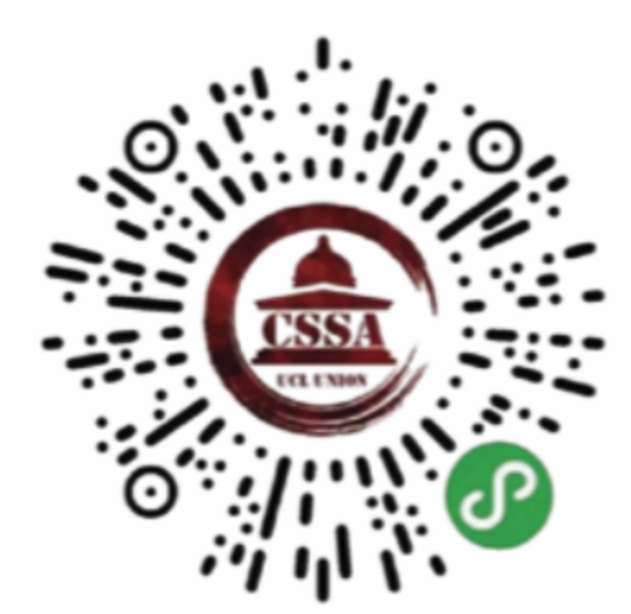

# 校园生活

## 新生活动

### Orientation Course

由于疫情，线上新生课程（online orientation course）取代了往年的国际新生周（ISOP，international student orientation programme）。2021年的线上新生课程从8.16开始可以自由观看，并且不是强制性参加的。注意你需要至少完成pre-enrolment后方可参加本课程。

同时，UCL也将会在八月到九月期间举办多场国际新生线上讨论会（international student orientation webinars）和国际学生线上安全讨论会（international student safety seminars）。想参加的同学可以到UCL官网自行报名。

### Welcome Week

welcome week是正式开学第一周（即2021.9.27）起的迎新周。Student Union会举办welcome fair，目的在于让新生接触并加入UCL的各个社团。每个专业也安排自己的新生活动，包括讲座、酒会等。本周并不会开始上课，是结识同学、过渡适应大学生活的最好时期。

## 课程设置

UCL每学年有三个学期，其中第一和第二学期为授课学期，第三学期主要以论文、考试和实践类课组成。课程由lecture、seminar、tutorial、workshop、practical sessions等组成，根据所学学科略有不同。

### 2021-2022学期及假期

| 学期 | 日期 |
| :--- | :--- |
| 第一学期 | 2021/9/27-2021/12/17（接圣诞假） |
| 第二学期 | 2022/1/10-2022/3/25（接复活节假） |
| 第三学期 | 2022/4/25-2022/6/10（接暑假） |

除了三个长假，2021/11/8和2022/2/14开始分别会有为期一周的reading week。一般情况下，文科专业不上课而是进行一些课外阅读，理科专业会安排实验课程，也有部分专业会安排Filed Trip。

### 学分及学制

学生每年需要选满120学分，每门课通常情况下是15学分或30学分。如果是三年本科分数占比为1:3:5；如果是四年本硕连读分数占比为1:3:5:5。大一和大二仅计入最好的90/120学分，大三将计入120/120学分。

### 选课

选课需要参考各院系9月的选课邮件，其中会有每门课的具体学分、其计算方式及包含所有课程简介、考核方式等信息的链接（Module Catalogue）。

新生选课通常在UCL Portico，My Studies一栏下进行，需要完成线上pre-enrollment后方可进行选课。学生可以将想选的课一并加在Selected Modules总框之下，页面简洁，操作较容易。递交选课前，为确保选课递交成功，需要确认所选课的课名、代码和总学分数是否都无误。每个专业的选课需求不同，有的专业大一全部为必修课（compulsory）则不需要自己选课。

在提交选课后，学生会收到UCL系统自动发来的选课递交成功的邮件。过段时间后，就会收到系统发来的选课是否都被确认的邮件，如果有部分课未成功或是人满了，则需要重新选课。

除了自己专业内或是系内的课，你也可以根据自己的爱好或规划选择其他专业、甚至是伦敦大学联盟内其他学校的课程。如UCL语言与国际教育中心（Centre for Languages & International Education）为全校学生提供了九门现代外语课程（且计入学分）。

## 授课形式

截止2021.7，UCL对新一学年的计划为 **线上课程及线下课程相结合** ，并希望在2021-2022学年能为所有同学开放校园。每个专业的线上线下课程比例会根据课程设置、课程内容等变化。同时UCL承诺，线上学习不会让课程质量降低。

### 国际学生

UCL希望国际学生能准备好在开学时到达英国，否则可能会错过校园活动及部分线下课程。如果由于特殊情况没有办法在开学季到达英国，UCL也会提供最多四周左右的线上支持。但如果更长的时间还是无法返校，学校建议延期一年入学。

## 网站介绍

### Moodle

Moodle是UCL的课程管理系统。每一年确定选课后，所有课程都会被注册在你的UCL user ID账号中，使用UCL user ID和密码登录moodle即可查看。

每一门课程模块（module）都会包含教授和导师上传的资料、课程回放、Reading list、科目的考核组成部分，并可以在forum中收到最新的通知、和导师同学一起讨论课堂外的延伸学术话题。提交作业、论文查重、查每项考核的成绩等也会在该网站进行。这个网站是UCL学生最重要最重要的学习平台之一，同学们一定要尽早熟练使用，Moodle上也有很详细的学生指南可以参考。

### Portico

从递交UCL申请的这一刻开始，Portico就和我们有了紧密的联系。作为个人相关信息及学业信息的集合，这个网站的功能非常丰富——线上pre-enrollment、查看学费金额和已收到的学费部分（针对分期付款的同学）、查看学校签发的CAS、选课和确认、申请换课、更新住址和个人信息、下载准考证、查看年度最终成绩单等。

### Timetable

UCL的学生可以通过登录online timetable网站，了解自己所有课程的上课时间、上课形式、上课地点和教师、讲师、所在的具体小组等，且所显示的课表都是自己的个人课表。

小贴士：UCL Common Timetable上的课表可以同步订阅到Outlook或者Apple Calendar的，这样就不需要每次上课前都去网站上查看啦。同时，UCLCSSA学联社区也支持一键导入自己的课表，小程序扫码登录UCL账号后即可查看。

## 校内设施

UCL坐落于伦敦市中心，除了设施先进的数十座教学楼，也有由不同校方组织管理和运营的校内设施，如博物馆、图书馆、食堂、剧院等。

### 博物馆

UCL 一共有 3 个属于自己的博物馆：埃及考古博物馆\(Petrie Museum of Egyptian Archaeology\)，动物博物馆 \(Grant Museum of Zoology\)和艺术博物馆\(Art Museum\)，博物馆同时也向公众开放。由于疫情开放时间可能会有变化，出行前请先查阅博物馆开放时间。

### 食堂及餐厅

UCL周围有很多不同口味及风格的餐厅，还有不少中餐馆。同时，Students' Union也有自己经营的四家咖啡馆（Bloomsbury Café/George Farha Café/Print Room Café/Gordon's Café/ ），皆位于校区内，购买十分方便。由于疫情很多餐厅都暂停营业了，就餐前务必查询清楚是否开放。

#### Main Refectory

在UCL主校区和主图学习的同学们可以考虑主食堂。这里不仅处于校园的中心地带，空间也很大，可以和很多小伙伴一起吃饭和学习。食物有很典型食堂感，有“偏甜少辣”的英国特点。

#### Pharmacy Refectory

位于 Russell Square校区，位置适合在 IOE 和 Pharmacy 上课的同学们。虽然食堂不大，食物的选择也不算多（其最大缺点），但是人比主食堂少，二楼也有阳台位。

### 图书馆及自习空间

UCL共有16个图书馆或是自习空间。不同的图书馆会有不同领域的藏书，如建筑学院图书馆、科学图书馆、教育学院图书馆。截止2021.7，进入UCL所有的图书馆或自习空间需要提前进行预约，入座后30分钟内进行签到，戴口罩以及保持一定社交距离。

UCLCSSA学联社区可以在线查询UCL所有图书馆的实时余位，十分方便。

#### Main Library

Main Library位于主楼一层。作为UCL最引以为傲的建筑之一，主图一直以来都是高大上的代名词。图书馆走廊的Flaxman Gallery更是著名电影《盗梦空间》的取景地。

#### Sciences Library

Science Library位于Malet Place。虽然环境和设施没有主图优越，但却是理科生们名副其实的聚集地。

#### Student Centre

无论是从四通八达的地理位置还是面向伦敦日落的景色，Student Centre都能被称为UCL 最好的学习场所之一。Student Centre 里面没有藏书，但是从负一楼到顶楼（除了G和M楼）都设有固定电脑。其内设的浴室，冥想室，祈祷室，Café，完全能够满足所有日常起居的需求（不建议同学们熬夜学习）。

#### IOE Library

IOE图书馆大概是文科生们最常去的学习场所了，这里给很人感觉就是安静和复古。除了啪啪的打字声，就只剩下大家苦读reading的叹息；图书馆的课桌是木制的，正方形的桌面，前方有个隔板，抬头思考放松时也不会被对面所影响。

## UCL服务

### 租借电脑

UCL为所有学生提供免费租借电脑的服务。具体租借点可查询“UCL Laptop Loans for Students”。租借时间为 24 小时\(周五、六、日所借电脑，周一上午 10 点必须归还\)。

### 打印/复印/扫描

领取到学生卡后，每个同学的卡中就已经有有 12 镑的 print credit，用完就需要自行充值。大部分的图书馆和自习空间都提供打印机。打印时准备好自己的学生卡和密码，将卡放在打印机的识别器上识别，注册打印机系统，在显示屏上输入ID和密码，最终等待打印机系统确人你的信息就可以进行打印了。

## 线上资源

### Reading List

登录Moodle，点击想查询reading list的课程模块，在页面右半部分“Library Resources”中点击reading list即跳转到本门课程的reading list。

### Online Library

UCL图书馆使用“UCL Explore”提供大量的线上资源，包括50,000+电子期刊及1,000+电子书，以支持每一位同学和老师的学习、研究和教学。在获得UCL user ID后，学生可以登录UCL Explore并搜索自己需要的线上资源。

同时，对于部分需要购买才能阅读全文的文献，也可以直接通过access through institution免费阅读和下载，如理科同学常用的Nature和Science。

### UCL Career

UCL职业团队（UCL Career）由经验丰富的专业人士组成，他们将引导你找到与你的职业规划相关的资源，帮助你快速确定未来方向。同时，UCL Career与英国和世界各地的近8000名雇主有联系，并会定期举办职业活动和招聘会。你还可以与专家、甚至是已经毕业的校友预约一对一洽谈。

每个学生都可以订阅感兴趣领域的实习信息，每周将会以邮件形式发送到UCL邮箱。除了实习、全职资源，UCL Career也提供线上课程，如CV撰写与修改、面试技巧、assessment centre技巧。

### UCL Mental Support

UCL十分在意每一位同学的心理健康。UCL Mental health and Wellbeing support团队为所有UCL学生免费提供心理辅导服务和精神支持。

## 学生社团

### Students' Union

Students’ Union是一个代表UCL学生的组织。SU的存在是为了确保每个学生的声音都能被听到，让学生在校和未来的生活都更加美好。SU 拥有300+社团和俱乐部，也就是你将在 Welcome Fair 里了解到的那些，UCLCSSA就是其中之一。此外，SU给学生提供参与竞选、志愿服务，工作机会等渠道，同时也经营着价格亲民的咖啡店、酒吧和商店。

SU提供的各种体育项目的规模在全英是数一数二的，加入UCL校队还有机会去英国各地比赛，为校争光。SU 也提供做义工的机会，有500+种不同类型的义工。每年有2000多名UCL学生定期做义工，奉献出的总时间量高达 6 万小时。

### UCLCSSA

伦敦大学学院中国学生学者联谊会（UCLU-CSSA）就是 SU 的众多社团之一，是接受中国驻英大使馆指导的非营利性学生组织。作为UCL最大的华人社团，我们长期以来得到了UCL校方、中国大使馆以及英国各界华人朋友们的广泛支持。我们会定期组织各种社会活动，如职业发展会，华语辩论赛，春晚，体育赛事，庙会，慈善晚会等。无论你想参加聚会结交朋友，了解求职前沿信息，传播中华文化，做慈善公益，教外国人中文，还是想吃中餐有折扣，在这里都可以实现。希望下学年学联招新时看到你的名字，也希望能在更多学联活动上有你的参与。

## 求职规划

!!! warning "提示" 

	本规划由UCLCSSA总结，仅作为参考，请理性借鉴
	

### 大一 \(First Year\) : Spring Week

Spring Week—般为期两周，在复活节期间，主要针对投行、咨询、商科相关行业。每年十月中旬开放给大一的学生申请，是了解英国各大公司及工作内容的好机会。有部分公司会给spring week期间表现优异的同学fast track第二年的summer internship。

### 大二 \(Second Year\) : Summer Internship

暑期实习是一个非常好的进入世界前200强大公司的机会。一般需要在大二的第一个学期开始申请 \(八月初开始\)。

### 大三 \(Final Year\) : Graduate Scheme

毕业后如想要留在英国在大学的最后一年，需要提前开始申请各个大公司的毕业生计划。

!!! info "提示" 

	针对不同的职业发展需要作出不同规划，**切忌盲目焦虑**。如生物相关专业的同学可以去寻找一些科研机会（可以直接给实验室老师发邮件networking）市场相关专业的同学可以积极参加一些商赛等。
	

