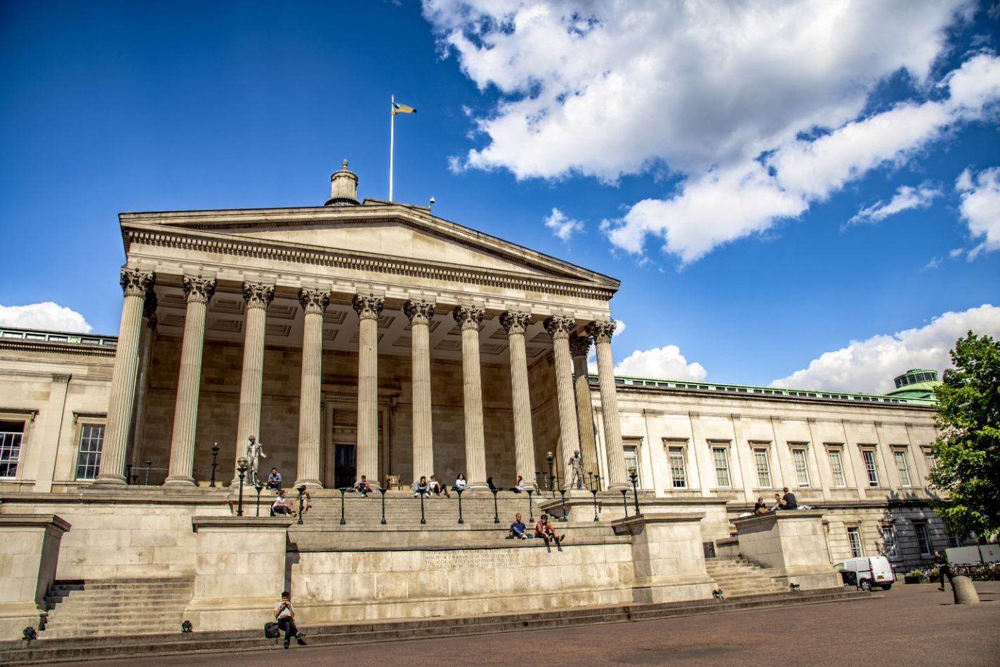
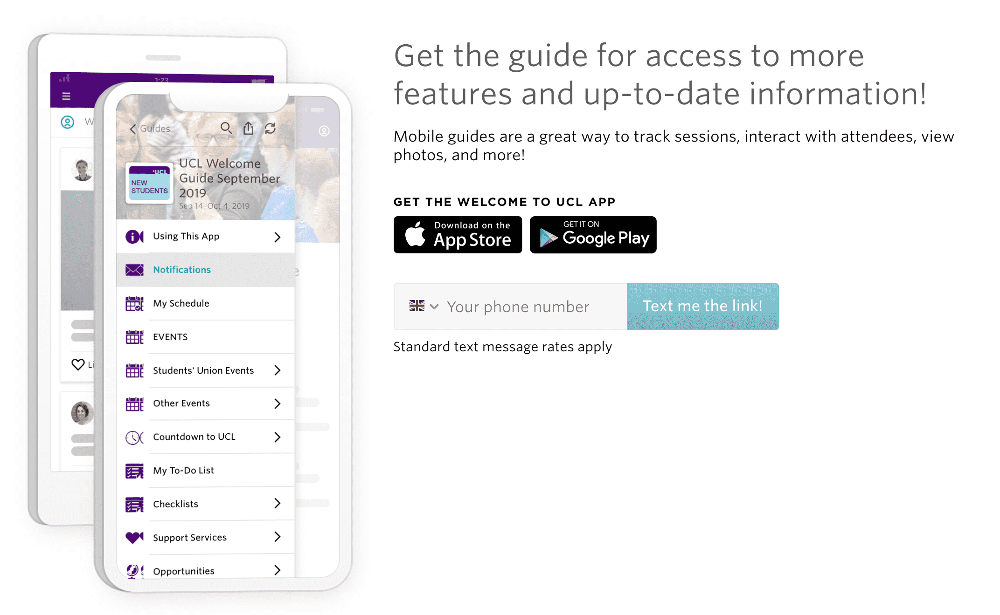

# 行前准备

## 签证政策


自2018年7月6日（并包含7月6日，此处日期指在线付费的日期，而非去递交材料的日期），中国公民办理英国T4学生签证不再需要资金证明、学历证明和英语语言成绩证明，即使不在国籍所在国申请签证也同样无需提供。所有签证材料需要原件和复印件，非英文材料需要认证翻译成英文（国内签证中心均提供翻译服务），更新后所需材料如下：

* 有效护照

!!! tip "提示" 护照至少有一页正反面均为空白页，两面不能有任何使用记录 · 护照信息页和签名页的复印件

* 旧护照（如果没有则不需要提供）

!!! tip "提示" 尾页要有签名 旧护照首页及尾页的复印件

* CAS信件

!!! warning "注意" 确认录取后，一周内学校会在Portico发出你的CAS，上面有你全部的个人信息。这份文件需要打印出来以便在办理签证的时候使用。

* 高中成绩单
* —张两寸照片
* 签证申请表
* 材料清单打印件（完成在线申请后可以下载）
* 学术技术审核证书（仅适用于部分人群，具体条款请查阅UKVI官网）
* 未满18周岁（16-18岁）需提供父母同意函以及关系证明
* 肺结核检测证明（在官方认证的医疗机构开具）
* 有效的生物信息卡（BRP）（如适用）

## 签证费

约人民币3100元（335英镑），需要直接在线支付。医疗附加费，150镑/年。

!!! warning "重要提示" 虽然不需要在申请签证时提供资金证明、学历证明和英语语言成绩证明，但并不代表学生可以不满足这些要求，其中包括签证及移民局和Tier4担保方（即UCL）的要求，UKVI仍保留以随机抽查的方式要求完整资料的权利。

抽查概率：较低，绝大部分人不会被抽查到

告知方式：通过电话或E-mail

补齐材料时间：10个工作日之内

审理时长：维持不变，15个工作日

加急件是否会被抽查：有一定概率，且可能会延长时间

## 随身重要物品

1. 健康证&疫苗本：在入关的时候抽查，如果没有的话可能需要在机场临时体检，拖延入关时间。
2. 宿舍、银行、警察局等地址联系方式清单：方便落地入住及头几天的各项注册。
3. 宿舍Cnformation Letter & Deposit Receipt：入住时需要出示。
4. 银行转账证明（如果提前转账给学费交费的话）：可以到学校的Financial Office开收据。
5. 证件照若干：用于落地的各项注册。如果已经确定要申请其他国家的旅行签证的话，建议也在国内准备好相关的证件照。
6. IB/A-Level成缋单或本科毕业证书\(原件及复印件\)：一来可以作为成绩和学位证明，二来可能在特定的时间作为除护照以外的身份证明。
7. CAS信、录取证明：办理入学手续时需要出示。
8. BRP：BRP既为生物信息卡，需要在到达英国十天内领取，可以在学校预约时间领取。

!!! warning "注意" 不参加ISOP的同学要有Enrollment的预约信。

```text
此类证件千万不要托运！
```

## 行前日用品清单

1. 常用药：请大家根据自己的身体情况带一些常用药，在英国看病开药手续繁琐，有时药不对症（感冒药、止泻药、云南白药等）。
2. 短期洗漱用品：可供落地后短期应急使用，之后有需要可在各大超市购买。
3. 适量衣服鞋子：伦敦冬天零度左右，通常情况夏天十几到二十度，今年夏天相对较热，可以多准备春秋季外套及长短T恤，准备1-2件冬季的厚外套。相关专业的同学可以准备一套正装以便特殊场合使用。
4. 转换插头等必要电子产品：可以选择购买1-2个转换插头配有万能插孔的。
5. 插线板：这样就可以解决英国和中国插座同时使用的问题。
6. 必要的学术用品：大家可以酌情带一些与专业相关的中文版入门书箱，以便刚开始学习的时候适应过渡期。
7. 被品：请根据个人情况携带，为了精简行李，也可以到英国以后再买。由于两国被品在尺寸上有差异，建议在英国购买被套床单等用具，入住学生宿舍时，可以购买价格50镑的床品组合短期应急（如需购买，请在确认宿舍时注明）。
8. 电饭煲：建议在国内购买，锅碗瓢盆等其余炊具可以在当地购买。注意肉类等物品不要携带，请查阅航空管理条例，不要带类似的敏感物体，以免行李被拆包，避免不必要的麻烦。伦教的Chinatown里中国商品从小吃、调味料到锅碗舰盆一应俱全，可供挑选。

## 注册登记



### Pre-Enrolment & Enrolment

在拿到Unconditional Offer并收到关于Pre-enrolment的邮件之后打开相应页面，获取自己的Userid和密码，并激活UCL Userid，在获取Userid和密码后，登陆Portico进行Online Pre-enrolment。

User Authentication Service（UAS）是UCL账户的密码，会根据密码的复杂程度在一定时段后过期，需要定期修改。如果需要自行手动修改密码的话则需要注册UAS，否则需要到Service Desk面对面修改。UAS账号密码同时也用于登陆UCL Eduroam的WiFi，在成功登陆一次之后WiFi会自动连接。

### 学费的付款方法

Enrol之前必须要交1/3（即第一个学期）的学费，剩下的2/3须在2月和5月之前付清（具体日期请查阅学校官网）。学费账户可在UCL官网查询到，注意学费账户与住宿费账户不同，交款前请核对信息无误。

### Enrolment

到校后凭护照和录取信换正式的Student Status Letter，并领取Student ID Card。多数 UCL的教学楼都需要ID Card才能进入。

## 警局注册

需要在入境七天内到警局注册，届时会需要准备好的注册表（可在官网下载）、两张护照照片、护照原件及签证复印件一份、地址证明和34镑注册费。由于每年入境的新生都很多，建议起早去排队来节省时间。所有新生（刚刚获得学生签证的学生）均需要前往注册。

!!! info "信息" 地点：Overseas Visitors Records office , 323 Borough High Street, London，SE11JU，

```text
最近地铁站：Borough Station

网址：content.met.police.uk
```

## ISOP官方新生活动 \(Optional\)

9月18日-9月24日举行的ISOP是 UCL 官方为国际生组级的新生活动，旨在学期开始之前使同学们提前了解、适应伦敦的生活。在ISOP的新生Package当中有一个小册子，是专门介绍伦敦的好去处的，大家可以适当关注。ISOP期间除了了解学校的周边的环境以外，更重要的是认识新同学，并尽早办理入学手续，避开开学以后的高峰。尽早有了学生证和在校证明以后，在学校的生活也更加游刃有余。

## 入住宿舍

宿舍的Office Hour, Contact Details和Location尤其重要。每一个宿舍的工作时间可能会有出入，有的几乎24小时有人值班，有的则朝九晚五，大家最好在落地之前确认好宿舍前台的工作时间，以免到了地方无法入住。必要的话可以订一晚宾馆，第二天再入住。另外，如果飞机晚点不能及时赶到，也需要跟宿舍联系，确保到达的时候有人安排入住。建议提前看好宿舍的方位，宿舍的详细地址和外立面的图片在每个宿舍的Handbook首页都能找到。

每个宿舍房间内的360度效果图，也都可以在宿舍网站上找到。每个宿舍不同房间类型的价格都有变化，按周计算，需要大家提前留意，宿舍费在收到Portico上的Invoice以后便可通过转账、刷卡或网银的方式支付，一般一学期一收。需要注意的是住宿费和学费的账户是不一样的。住宿费账户可在UCL官网査询，交款前请务必确保所有信息正确。

如需要提前入住，必须向UCL Residence Office申请并确认，多出的宿舍费会在Portico的Invoice当中显示。

www.ucl.ac.uk/prospective-students/accommodation

## UCL Moodle

这是UCL大多数学生必备的网页，也是同学们经常浏览查看的网站。在这里注册所学的课程，下载老师的课件和作业，并查询平时作业和考试的成绩。

[https://moodle.ucl.ac.uk](https://moodle.ucl.ac.uk)

## NHS 注册

National Health Service 是全英国的全民医保系统，只要在英国求学超过6个月都可以注册加入，享受医疗。UCL的NHS诊所在Gower Place，学校背面的小街上。

[http://www.gowerplacepractice.nhs.uk](http://www.gowerplacepractice.nhs.uk)

## 银行开户

银行账户种类大致可分活期存款账户（Current Account）和定期存款账户（Savings Account）两种。

活存账户利率低，但可随时开支票或提取现金。定存账户一般定有条款，有最低金额限制，有的提供和活期存款一样的转账、支票等项目；若要提款则需要提前90天或30天告知（也有随时可以提款的Instant Access），否则要罚款，但利率也较高。

学生账户（Student Account）属活存的一种，一般只有Full-time Student有资格申请。

英国主要银行有HSBC, Natwest, Barclays, Lloyds等，它们都有学生账户。有的银行如Bank of Scotland, Royal Bank of Scotland为吸引学生，特别提供优惠利率，可考虑利用。

建议大家综合衡量之后选择最方便、最适合自己的银行开户。

## UCL 官方新生 Checklist 及 App

UCL官方为新生准备了一份来英之前的Checklist，以及每周更新一次的 Countdown to UCL 博客，主要内容以学习和生活方面的准备为主。你可以进入下面的链接订阅每周博文，以及为新生周，enrolment等做准备。

> UCL新生官网 [https://www.ucl.ac.uk/students/new-students](https://www.ucl.ac.uk/students/new-students)

与此同时UCL还提供了Guidebook App，内容类似于上方网站，但更易于阅读。



可直接进入 [https://guidebook.com/g/ucl-welcome-september-2019/](https://guidebook.com/g/ucl-welcome-september-2019/) 选择苹果或安卓下载。

若在国内安卓用户无法下载，不用担心，学联也已早早为你考虑，你可以直接进入 [https://uclcssa.cn/public/apk\_download/](https://uclcssa.cn/public/apk_download/) 直接下载apk安装~ （小程序内打开请复制下方链接）

```text
https://uclcssa.cn/public/apk_download/
```

