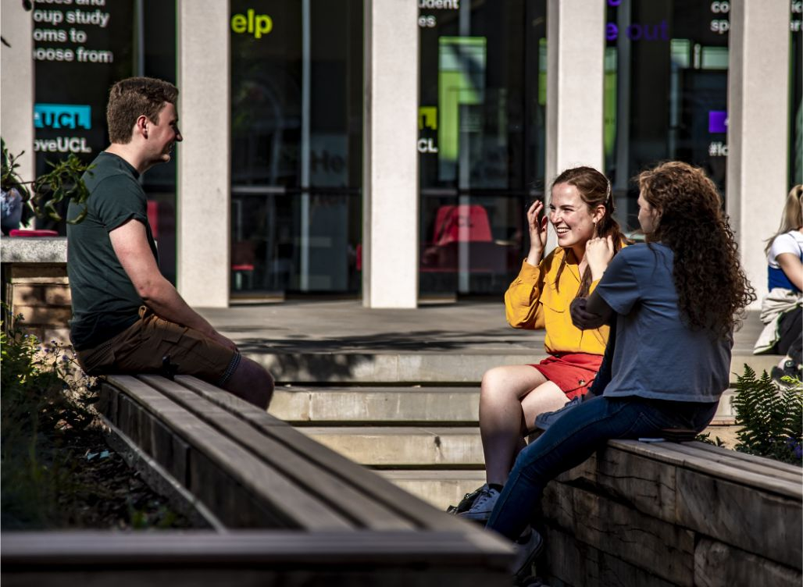

# 学校生活

## 实习及工作

在西方求职，面试有一定的套路，一般情况下, 雇佣者主要向应聘者提一些普通问题，侧重于了解应聘者的表达能力，应变能力以及专业水平等。最常被问到的问题往往包括:请简单介绍一下您自己, 您的同事们怎样描述您，您近期的工作目标是什么，您打算怎么实现这一目标，为什么要申请这个职位，我为什么应该聘请您做我的雇员等。

对于技术性很强的专业比如计算机专业，有些用人单位除进行一般性考核外，还设有专业性考试，考题经常是又偏又难，一旦被录用，剩下的问题就得靠雇主了，比如她负责为你向英国政府申请工作许可\(work permit\)。有了工作许可，你才可以申请工作签证。每家公司的海外雇员工作许可的配额以及每个工作许可的有效年限都不相同，通常取决于该公司的实力和信誉。另外，在英国工作一定不要忘记办理国民社会保险号 \(National Insurance Number\)。

英国法律规定，一旦开始工作，必须在6周内加入社会保障体系，而社会保险号也就是你加入后取得的账号，没有社会保险，雇主无法报税，因而也就不能给你发工资，申请保险号时，需要出示雇主的证明信、护照以及地址证明等，整个审批过程大概需要6个星期。

* 大一\(First Year\) : Spring Week Spring Week—般为期两周，在复活节期间，每年十月中旬开放给大一的学生申请，是一个了解英国各大公司的好机会。
* 大二\(Second Year\) : Summer Internship 暑期实习是一个非常好的进入世界前200强大公司的机会，一般需要在大二的第一个学期开始申请\(九月初开始\)。
* 大三\(Final Year\) Graduate Scheme 毕业后如果想要留在英国，在大学的最后一年就提前开始申请各个大公司的毕业生计划。
* Insight Day 一般会有一个演讲告诉你大公司的大概历史，都有哪些部门，这些部门分别都在做什么。
* Vacation Programme: 根据地点不同，为其4-8周不等，一般在6, 7月入职，需要提前一年申请。

## 学校生活

* 预科生

全年三个学期，对于大部分学生来说，考试基本集中在term3,根据入学英语参加分班考试成绩很重要，10 届UCL50%留本效率。极少学生考入牛津剑桥，部分学生考入帝国理工、华威、圣安德鲁斯、巴斯等学校。可尝试参加不同的社团，锻炼能力。

* 本科生

全年3个学期，前两个学期上课，第三学期考试\(即复活节后，考试时间从4.23—直持续到5月底\)。大部分学科大学3年成绩比重为1: 3: 5 \(具体信息请查看开学第一周系内发放的Course Booklet\)。每周上课时间因学科而不同，从8-30小时不等。每学年八门课，计四个学分，每年必须拿到一定的学分。可尝试参加不同的社团，锻炼能力，了解英国学生组织或专业组织的工作方式。

* 研究生

学制与本科基本相似，但没有暑假假期。某些学科课时较少，建议利用闲暇时间旁听其他专业课程。 除了考试以外，研究生必须要完成毕业论文。由于只有一年时间，所以比较紧张，但是还是有充足的课余时间。

* 博士生

大部分博士生有自己的办公室，课业松紧全凭导师，每天朝六晚十的上下班，没有固定的大假期，休假时间比较自由，建议时常参加系内的Networking活动，拓展学术人脉

## Facilities in UCL

可登陆 [http://www.ud.ac.uk/maps](http://www.ud.ac.uk/maps) 查询图书馆、教室、 学生宿舍以及服务设施的地点。


UCL Online Library Services \(网络图书馆\) [https://www.ucl.ac.uk/library/eresources.shtml](https://www.ucl.ac.uk/library/eresources.shtml)


Student centre 是UCL斥巨资建立的一个超豪华图书馆，24h开放，有千余座位，馆内设置了café,学习小组讨论房间，安静自习室，在里面可以讲话的学习室。配备的电脑都是最新的，也可以租借笔记本电脑～底层可以洗澡，café的微波炉可以热饭（精致大学生的福音），楼顶还有超大露台，学习累了可以上去坐坐，吹吹风，俯瞰伦敦景观… 设施非常齐全，非常推荐大家去，不过论文季基本人满为患，需要大家提前去占座～

UCL 一共有18+图书馆，另外一些比较好的图书馆有

* UCL Main Library
* Cruciform Hub
* UCL Senate House Hub
* UCL Science Library
* UCL Institute of Education Library


大多数图书馆都有安静学习区和小组讨论区，图书馆开馆时间也不尽相同，大家可以自行上官网浏览。


